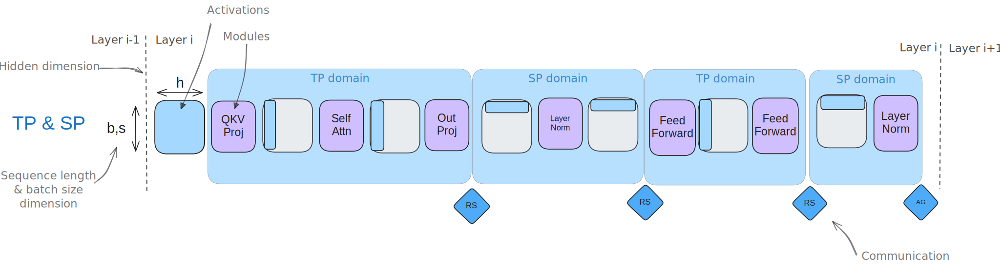
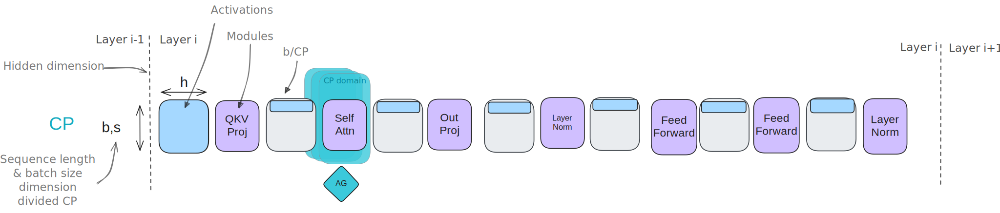
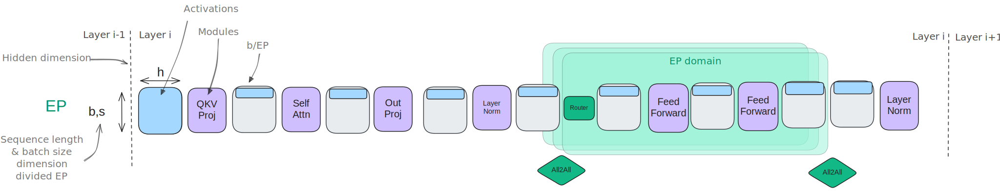
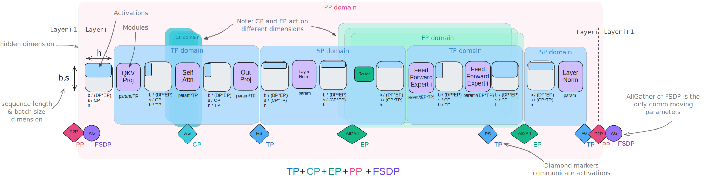
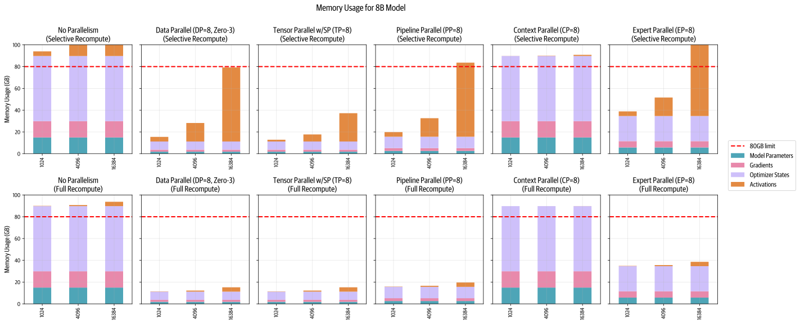

# 5D Parallelism in a Nutshell

*From [The Ultra-Scale Playbook](https://huggingface.co/spaces/nanotron/ultrascale-playbook)*

## 5D Parallelism in a Nutshell

Congratulations, reader! You have now seen all five parallelism strategies you can use to scale model training:

1. Data parallelism (DP) – along the batch dimension
2. Tensor parallelism (TP) - along the hidden dimension
3. Sequence and context parallelism (SP/CP) - along the sequence dimension
4. Pipeline parallelism (PP) - along the model layers
5. Expert parallelism (EP) - along the model experts

as well as the three ZeRO strategies that can be combined with data parallelism for memory reduction:

1. ZeRO-1 – sharding optimizer states among the DP replicas
2. ZeRO-2 – sharding optimizer states and gradients among the DP replicas
3. ZeRO-3 – sharding optimizer states, gradients, and parameters among the DP replicas

At this stage, one aspect you are probably curious about is how all these parallelism and ZeRO strategies compare to, and interact with, one another. In other words, which ones can we use and efficiently combine together, and which ones should we keep separated?

Let’s take a look at the similarities and interplay. We'll start by comparing pipeline parallelism are ZeRO-3 side-by-side, as they have some very close similarities but also important differences.

Both **pipeline parallelism** and **ZeRO-3** are ways to partition the model weights over several GPUs and perform communication/computation along the model depth axis (for example, in ZeRO-3, we prefetch the next layer while computing). This means in both cases full layer operations are computed on each device, as opposed to with TP or EP, for instance, in which computations are performed on sub-layer units.

However, there are a few major differences between the PP and ZeRO-3 approaches:

|  | **ZeRO-3** | **Pipeline Parallelism** |
| --- | --- | --- |
| Each compute unit stores... | only a fraction of a layer | a full layer |
| Communication is used to transfer... | weights | activations |
| Orchestration | Model-agnostic | Model-agnostic |
| Implementation challenges | Complex to handle model partitioning and communications | Complex to handle efficient PP schedules |
| Scaling considerations | Prefers large $mbs$ and $seq\_len$ to hide comms | Prefers large $grad\_acc$ to hide bubble |

As you can see, ZeRO-3 and PP solve the same challenge but involve different approaches, and the choice between them will depend on whether you decide to focus communication on transferring weights or activations. While they can be combined, it's not often done in practice as doing so requires increasing the global batch size significantly to amortize the communication costs, creating a trade-off between global batch size, model size, network bandwidth, and training efficiency. If you decide to combine them, ZeRO-3 should be configured to keep the weights in memory during the series of PP micro-batches to minimize as much as possible unnecessary communication overhead.

On the other hand, ZeRO-1 and ZeRO-2, which focus on optimizer states and gradients, can be easily combined with pipeline parallelism and are complementary to it. These combinations don't raise any particular new challenges. For instance, the training of DeepSeek-v3 used PP combined with ZeRO-1.

**Tensor parallelism** (with **sequence parallelism**) is naturally complementary to and can be combined with both pipeline parallelism and ZeRO-3, as it relies on the distributive property of matrix multiplications, which allows weights and activations to be sharded and computed independently before being combined.

The main reason we don't want to use TP only for parallelism is that, in practice, TP has two limitations (which we've discussed in previous sections). First, since its communication operations are part of the critical path of computation, it's difficult to scale well beyond a certain point, after which communication overhead begins to dominate. Second, unlike ZeRO and PP, which are model-agnostic, TP requires careful handling of activation sharding - sometimes along the hidden dimension (in the TP region) and sometimes along the sequence dimension (in the SP region) - making it more cumbersome to implement correctly and requiring model-specific knowledge to ensure proper sharding patterns throughout.

As a consequence, when combining parallelism strategies, TP will typically be kept for high-speed intra-node communications, while ZeRO-3 or PP can be used for parallelism groups spanning lower-speed inter-node communications as their communication patterns require less bandwidth (for PP) or can be more easily overlapped with computation (for ZeRO-3). The main consideration when combining these techniques is to organize the GPUs efficiently in groups for each parallelism dimension to maximize throughput and minimize communication overhead, while being mindful of TP's scaling limitations. For instance, the groups of GPUs communicating for TP should be kept inside nodes.

**Context parallelism** and **expert parallelism** also help us shard activations, and can be seen as complementary to TP. CP handles long sequences while EP enables distributed Mixture of Experts training, and they can be combined without any particular issues.

CP specifically targets the challenge of training with very long sequences by sharding activations along the sequence dimension across GPUs. While most modules, like MLP and LayerNorm, can process these sharded sequences independently, attention blocks require communication since each token needs access to keys/values from the full sequence. As we saw in the [CP section](#context_parallelism), this is handled efficiently through Ring Attention patterns that overlap computation and communication. CP is particularly valuable when scaling to extreme sequence lengths (128k+ tokens) where, even when using full activation recomputation, the memory requirements for attention would be prohibitive on a single GPU.

**Expert parallelism** specifically targets the challenge of training MoE models by sharding specialized "experts" across GPUs and dynamically routing tokens to relevant experts during computation. The key communication operations in EP are the "all-to-all" operations routing tokens to their assigned experts and gathering the results back. While this introduces some communication overhead, it enables scaling model capacity significantly since each token is only processed during inference (and training) by a much smaller fraction of the total parameters. In terms of distributed training/inference, partitioning experts across GPUs becomes relevant when models scales to a large number of experts.

📝 Note

This similarity between EP and DP in terms of input handling is why some implementations consider expert parallelism to be a subset of data parallelism, with the key difference being that EP uses specialized expert routing rather than having all GPUs process inputs through identical model copies.

### Scope and focus

Let's also quickly summarize the sub-parts of the model where these different parallelism strategies have the most impact:

- Tensor parallelism (and sequence parallelism) affects computation throughout the entire model by sharding both weights and activations.
- Context parallelism primarily impacts attention layers, since that's where cross-sequence communication is required, with other layers operating independently on sharded sequences.
- Expert parallelism primarily affects the MoE layers (which replace standard MLP blocks), leaving attention layers and other components unchanged.
- Pipeline parallelism and ZeRO are not especially specific to any submodule or component, with the exception that modules and layers need to be balanced in pipeline parallelism (the first and last layers are thus often treated differently due to the additional embedding layers).

| **Tensor + Sequence Parallel** | **Context Parallel** | **Expert Parallel** |
| --- | --- | --- |
| Shards weights and activations along hidden/seq dim | Shards activations along sequence dim | Shards specialized expert weights and activations |
| Communication for matrix multiplication operations (column/row linear) | Communication for attention keys/values | Communication for token routing to experts |
| Model-specific implementation needed | Model-agnostic except for attention | Model-agnostic except for MoE layers |
| Prefers high-bandwidth intra-node communication | Prefers large sequence lengths | Requires MoE layers |

### Summarizing it all

Now, what about gathering all the techniques we've seen into a single diagram combining them all? Yes, we're up for the challenge!

In this summary diagram, you will find illustrated activations and modules for a single transformer layer, in its MoE variant. We also illustrate the various directions of parallelism and the communication operations we've been discussing in the previous sections.

We can also give a **full overview** of the memory savings for each of these strategies. We'll plot them with different sequence lengths as well as with selective (top) and full (bottom) recomputation so you can see how they all play with activations:

Let's finish this section with a high-level view of all of these techniques, their main underlying ideas, and their major bottlenecks:

| **Method** | **Memory savings apply specifically on...** | **Parallel/sharding dimension** | **Disadvantage** |
| --- | --- | --- | --- |
| DP | Activations (reduce local batch size) | Batch | Limited by max batch size |
| PP | Model parameters | Model layers | Idle bubble and complex schedules |
| TP+SP | Model parameters and activations | Hidden dimension/sequence length | Requires high-bandwidth communication |
| CP | Activations | Sequence length | Adds communication overhead in attention modules |
| EP | Experts parameters | Experts dimension | Requires MoE layers, adds routing communication overhead |
| ZeRO-1 | Optimizer states | Sharded among DP replicas | Params communication overhead |
| ZeRO-2 | Optimizer states and gradients | Sharded among DP replicas | Params communication overhead |
| ZeRO-3 | Optimizer states, gradients, and model parameters | Sharded among DP replicas | Params communication overhead |

Clearly, none of these techniques is a silver bullet for magical scaling, and we'll often have to combine them in one way or another. Can we actually come up with a few rules that will help us find a good starting point to choose among (and combine) them? This will be the topic of the next section.
