# Diving into the GPUs – Fusing, Threading, and Mixing

*From [The Ultra-Scale Playbook](https://huggingface.co/spaces/nanotron/ultrascale-playbook)*

## Diving into the GPUs – Fusing, Threading, and Mixing

To add a podcast feeling to your reading experience, feel free to listen to the NotebookLM hosts discussing the following sections of this book as you're reading along.

Up to now, our discussion has been focused on the high-level organization of our model operations. We’ve moved computations around on various accelerators, taking into account general memory constraints and high-level scheduling of the compute units.

But this ignored all the optimizations we can do at a much lower level by carefully understanding how our model operations are scheduled and performed on each GPU.

This section will dig into the details of GPU architecture. We’ll focus on NVIDIA’s GPU architecture in particular, but the general ideas, as is often the case, can be reused on similar accelerator units.

We’ll briefly explain how GPUs are organized before covering the FlashAttention revolution, how to efficiently schedule workloads on GPUs, and  how various precisions can be efficiently used on GPUs.

### A primer on GPUs

Generally, GPUs have a very hierarchical organization. On the compute side, a GPU consists of an array of compute units called ***streaming multiprocessors (SMs)***. Each SM contains and controls a set of streaming processors, also known as *cores*. For example, an NVIDIA H100 GPU has 132 SMs with 128 cores per SM, resulting in a total of 16,896 cores (see [the docs for tensor cores](https://resources.nvidia.com/en-us-tensor-core) for details), each capable of handling multiple threads simultaneously.

Source: https://blog.codingconfessions.com/p/gpu-computing

The memory side is also highly hierarchical, with several layers of cache and memory. *Registers* are the smallest units and are private to the threads during executions. *Shared memory* and the *L1 cache* are shared between the threads running on a single SM. Higher up is the *L2 cache* shared by all SMs, and finally there is the *global memory*, which is the largest memory on the GPU (the advertised 80 GB for an H100, for instance) but also the slowest to access and query.

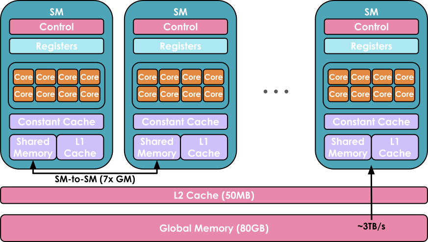

Source: https://www.youtube.com/watch?v=ZQKMZIP3Fzg

The goal when using a GPU is to run as many workloads as possible, in parallel, on the available cores, by taking advantage of this hierarchical organization of compute/memory resources.

A piece of code running on a core of the GPU is called a ***kernel***. It can be written at a high level in CUDA or Triton, for instance, and is then compiled to Parallel Thread Execution (PTX), the low-level assembly used by NVIDIA GPUs.

To run the kernel you will also need some ***host code***, which is executed on the CPU/host and takes care of preparing data allocations and loading data and code:

Host code for a CUDA kernel for adding two vectors, adapted from https://docs.nvidia.com/cuda/cuda-c-programming-guide/ and https://blog.codingconfessions.com/p/gpu-computing

Device code containing the definition of the vector addition kernel, adapted from https://docs.nvidia.com/cuda/cuda-c-programming-guide/ and https://blog.codingconfessions.com/p/gpu-computing

Kernels are generally scheduled as follows:

- Threads are grouped in *warps*, each containing 32 threads. All the threads in a warp are synchronized to execute instructions simultaneously but on different parts of the data.
- Warps are grouped in larger *blocks* of more flexible size (for example, there may be 512 or 1,024 threads in a block), with each block assigned to a single SM. An SM may run several blocks in parallel. However, depending on the resources available, not all of the blocks may get assigned for execution immediately; some may be waitlisted until more resources become available.

The main thing to retain here is that there are various sizing and allocation constraints (size of the various memories, number of concurrent blocks and threads in the warps) which need to be taken into account to use the GPU architecture in the most efficient way.

Most of the time, you don’t need to go down to this level of precision and you can reuse the kernels and code prepared by other members of the community - but we'll give you a few tips on getting started with kernels anyway!

### Improving performance with kernels

If you’re looking to add a new operation that lacks an optimized kernel or to speed up an existing PyTorch function, writing kernels from scratch might seem like the most direct route. However, creating high-performance CUDA kernels from scratch requires extensive experience, and there's a steep learning curve. Generally, a better way to get started is to leverage `torch.compile`, which dynamically optimizes PyTorch code by capturing your operations and generating lower-level, high-performance kernels in Triton.

Let’s suppose you want to write a kernel for the Exponential Linear Unit (ELU) activation function:

$$\text{ELU}(x) = \begin{cases}
            e^x - 1 & \text{if } x < 0 \\
            x & \text{if } x \geq 0
            \end{cases}$$

You can start by writing a simple PyTorch implementation, and then just add the `@torch.compile` decorator on top:

As you can see in the following graph, there's a remarkable performance difference between the compiled and non-compiled versions, especially given that we only added a decorator ($N$here is the number of columns):$$

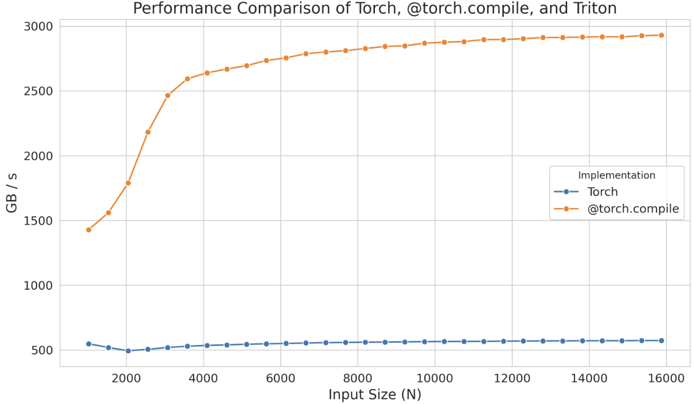

However, if this performance increase is insufficient, you can consider implementing Triton kernels. As a starting point, you can take a look at the Triton kernel generated by `@torch.compile`. To do so, you simply need to set the environment variable `TORCH_LOGS` to `"output_code"`:

Once you run the Python script with the `@torch.compile` decorator, it will generate and output the corresponding Triton kernel, which in this case is:

To enhance readability, we can modify the variable names, add comments, and make slight adjustments (or ask an LLM to do it for us), as demonstrated below:

Here, `tl.program_id(0)` provides a unique block ID, which we use to determine which section of data that block will process. Using this block ID, `block_start` calculates the starting index for each block’s section, while `block_indices` specifies the range of indices within that section. A `valid_mask` ensures that only indices within `num_elements` are processed, safely loading the data with `tl.load`. The ELU function is then applied, modifying values based on whether they're negative, and results are written back to memory with `tl.store`.

When we benchmark the generated kernel using `triton.testing.Benchmark`, we have the following performance:

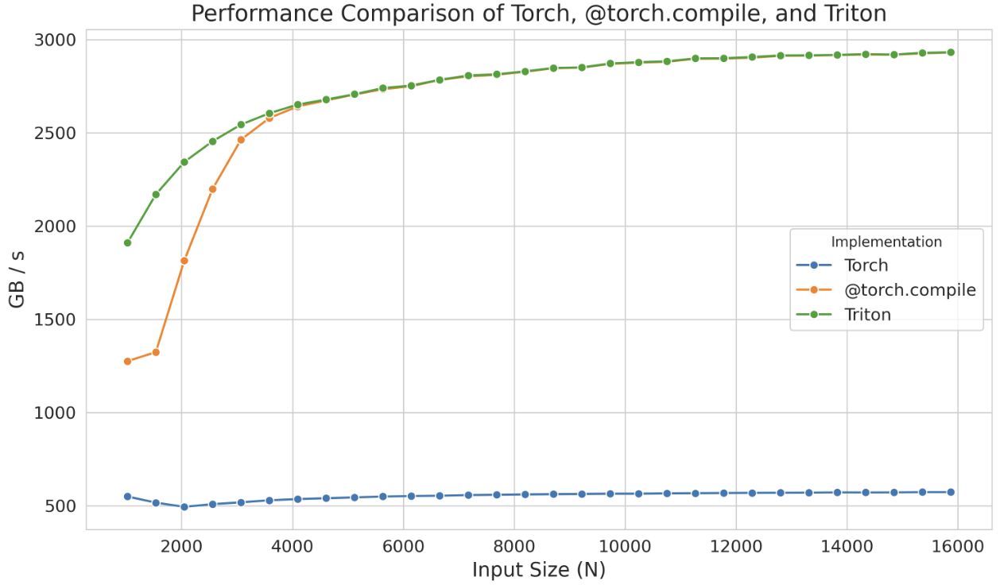

This standalone kernel even demonstrates superior performance with smaller sizes compared to `@torch.compile`, but this is likely just an artifact of the compilation time of `torch.compile`. In any case, instead of starting from scratch, remember that you can start from such generated kernels and focus your attention on optimizing their performance, saving you a lot of time.

Even in Triton, sometimes we cannot fully achieve the peak performance of the device due to the language's limitations in handling low-level details like shared memory and scheduling within streaming multiprocessors. Triton's capabilities are restricted to blocks and scheduling of blocks across SMs. To gain even deeper control, you will need to implement kernels directly in CUDA, where you will have access to all the underlying low-level details.

With CUDA, various techniques can be employed to improve the efficiency of kernels. We will cover just a few here: optimizing memory access patterns to reduce latency, using shared memory to store frequently accessed data, and managing thread workloads to minimize idle time.

Before we dive deeper into CUDA examples, let's summarize the tools we've seen that let us write kernel code to execute instructions on the GPU:

1. PyTorch: easy but slow
2. `@torch.compile`: easy, fast, but not flexible
3. Triton: harder, faster, but more flexible
4. CUDA: hardest, fastest, and most flexible (if you get it right)

We'll start by looking at one of the most frequent uses of CUDA: optimizing memory access. The global memory in GPUs (the largest memory area, as you saw earlier) has a long latency and low bandwidth in comparison to the cache, creating a major bottleneck for many applications. Efficiently accessing data from global memory can greatly improve performance.

#### Memory coalescing

To effectively utilize the bandwidth of global memory, it is essential to understand its architecture. In CUDA devices, global memory is implemented using DRAM.

***Memory coalescing*** takes advantage of how DRAM delivers data in bursts whenever a memory address is accessed. Each time a DRAM location is accessed, a sequence of consecutive locations (including the requested one) is read in parallel by multiple sensors in the DRAM chip. Once read, this data can then be quickly transferred to the processor as a burst. In CUDA, coalescing uses this burst behavior to maximize memory access efficiency by ensuring that threads in a warp — a set of 32 threads that execute the same instruction in lockstep — access consecutive memory locations. For instance, if thread 0 accesses location $M$, thread 1 accesses $M + 1$, thread 2 accesses $M + 2$, and so forth, the GPU hardware coalesces or combines these requests into one large, efficient access request for the DRAM burst, rather than handling each access individually.

Let’s take the example of matrix multiplication. A simple, straightforward implementation would have each thread compute a single element of the output matrix, like this:

Here’s an excellent visualization of the kernel from Simon Boehm’s fantastic [blog post](https://siboehm.com/articles/22/CUDA-MMM):

However, when profiling this kernel with a tool like `ncu`, we can see issues, including low memory throughput and uncoalesced memory accesses:

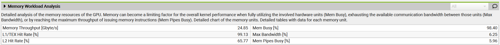

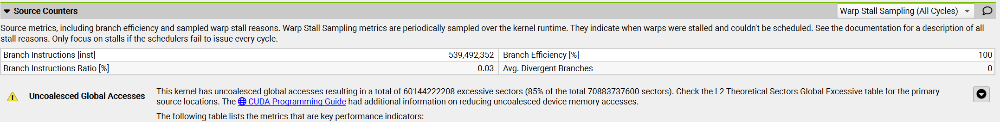

The reason for this is that in this kernel, two threads in the same block with thread IDs `(0, 0)` and `(1, 0)` (which will end up in the same warp) will both load from the same column of matrix **B** but different rows of matrix **A**. Since matrix elements are stored in row-major order (meaning row elements are in consecutive memory addresses, as shown in the figure below), thread `(0, 0)` will load $A_{0,0}$ and thread `(1, 0)` will load $A_{1,0}$ in the first iteration, $i = 0$. These elements are not stored close to each other in memory, and this misalignment will be present at each iteration, thereby preventing memory accesses from being coalesced.

To improve the performance of our kernel, we can change the way coordinates `x` and `y` are calculated to the following:

Instead of using a 2D block, we switch to a 1D block and redefine how we determine the values of `x` and `y`. In this new method, threads within the same warp (which have close `threadIdx.x` values) will share the same `x` value but have different `y` values. This means that they will load the same row of matrix **A** but different columns of matrix **B**. As a result, memory accesses can be coalesced for a row-major matrix.

When we profile our new kernel, we notice that the warning about uncoalesced memory accesses has disappeared, and **the GPU's memory throughput has increased by approximately a factor of 10**.

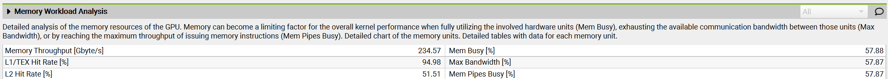

We also notice that **the execution time of the kernel has decreased by 10x**. Amazing!

Now let's cover another technique you will often see mentioned in the literature: ***tiling***.

#### Tiling

Tiling is a technique that leverages shared memory to optimize memory access patterns. As we mentioned earlier, the shared memory on a GPU is a small, fast memory area accessible by all threads within a block. It allows data to be reused by multiple threads, reducing the need to repeatedly load data from the slower global memory.

In matrix multiplication, for example, each thread in a block may need elements from two matrices, say **A** and **B**. If each thread independently loads the row and column it needs from global memory, we'll end up with many redundant loads, as multiple threads in a block will access overlapping data. Instead, we can use tiling to load a block (or "tile") of **A** and **B** into shared memory just once, allowing all threads in that block to reuse the same shared data.

In the tiling approach, each iteration involves all threads within a block cooperatively loading two tiles — one from matrix **A** and another from matrix **B** — into shared memory. Specifically, the threads load a tile of matrix **A** (of size `BLOCK_SIZE_M` by `BLOCK_SIZE_K`) and a tile of matrix **B** (of size `BLOCK_SIZE_K` by `BLOCK_SIZE_N`). Once the tiles are in shared memory, the threads perform matrix multiplication on these tiles, enabling efficient computation since all the necessary data is quickly accessible. The results of the tile multiplication are stored in an accumulation matrix that holds intermediate results. After each iteration, the results from the current tile multiplication are added to this accumulation matrix, continuing until all tiles from both matrices have been processed.

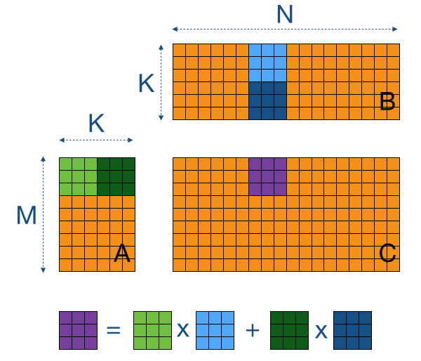

From [https://cnugteren.github.io/tutorial/pages/page4.html](https://cnugteren.github.io/tutorial/pages/page4.html)

Let's take a look at the important parts you need to understand from the implementation:

Each thread begins by loading one element from both matrix **A** and matrix **B** into shared memory. In this scenario, achieving coalesced memory access is straightforward: by assigning `threadIdx.x` as the *local column index* (`localCol`), we ensure that threads within the same warp will access adjacent elements of both matrices. After each thread in the block completes loading its elements into shared memory (ensured by calling `__syncthreads()`), they proceed to compute the dot product of the two tiles. Once the threads have iterated through all the tiles — horizontally for **A** and vertically for **B** - the resulting sum is stored in the corresponding location of matrix **C**.

When benchmarking this kernel using `ncu`, we noticed that the memory throughput increased to 410 Gb/s and the kernel execution time decreased by ~43%, achieving a ~6.6 TFLOPS performance.

#### Thread coarsening

The tiling technique has significantly improved the performance of our kernel. However, when analyzing the warp states, which quantify how many cycles were spent in each state, we observe the following:

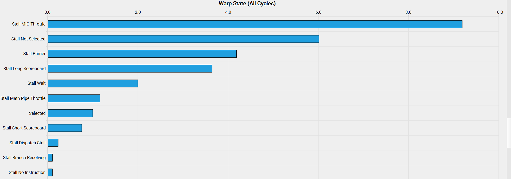

The meaning of these cryptic state names can be found in [NVIDIA's Kernel Profiling Guide](https://docs.nvidia.com/nsight-compute/ProfilingGuide/index.html#metrics-reference), in the "Warp Stall Reasons" section. There, we see that `smsp__pcsamp_warps_issue_stalled_mio_throttle` indicates "Warp was stalled waiting for the MIO (memory input/output) instruction queue to be not full. This stall reason is high in cases of extreme utilization of the MIO pipelines, which include special math instructions, dynamic branches, as well as shared memory instructions. When caused by shared memory accesses, trying to use fewer but wider loads can reduce pipeline pressure."

So it seems warps are stalling waiting for shared memory accesses to return! To solve this issue we can apply a technique called ***thread coarsening***, which involves merging several threads into a single coarsened thread. This will significantly reduce shared memory accesses, as each coarsened thread can handle multiple output elements.

Next, let's briefly go through a last important consideration when writing or improving custom kernels: ***minimizing control divergence***.

#### Minimizing control divergence

A streaming multiprocessor is built to execute all threads in a warp using the *Single Instruction, Multiple Data (SIMD)* model. This means that at any given moment, one instruction is fetched and executed simultaneously for all threads within the warp. When a warp is executed, the threads within it operate on different segments of the data but follow the same instruction (hence the name Single Instruction, Multiple Data). The primary advantage of SIMD is its efficiency: the control hardware responsible for instruction fetching and dispatching is shared among multiple execution units. This design minimizes the hardware overhead associated with control functions, allowing a greater portion of the hardware to focus on improving arithmetic throughput.

*Control divergence* occurs when threads within the same warp take different execution paths. For instance, if a conditional statement (like an `if` statement) leads to some threads executing one block of code while others execute a different block, the warp must serialize these executions, resulting in idle threads waiting for others to complete.  To minimize control divergence, we need to design kernels to ensure that threads within the same warp follow the same execution path. This can be achieved by restructuring code to reduce branching, using data structures that ensure all threads follow similar execution paths, or employing techniques such as predication.

We have covered some of the main considerations when writing custom kernels and improving the performance and memory footprint of GPU operations. But there’s one more important concept to consider before we move to a real example: ***fusing kernels***.

### Fused kernels

In several places now, we’ve mentioned how GPU and CPU operation can be asynchronous. In particular, the host code on the CPU can schedule workloads on the GPU in a non-blocking way.

This can be useful for overlapping communication and computation – as we've seen many times in our journey – but it can also be extended to the more general idea of trying to avoid, at all cost, going back and forth between host and GPU kernel commands.

This idea is beautifully illustrated by [Horace He](https://upload.wikimedia.org/wikipedia/commons/b/b2/Hausziege_04.jpg) in [these diagrams:](https://horace.io/brrr_intro.html)

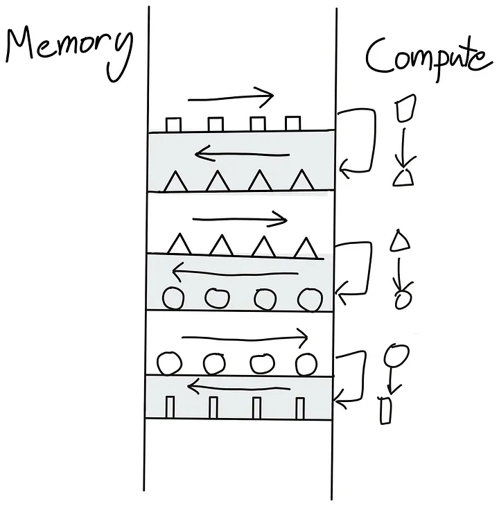

A sequence of kernels requiring back and forth between global memory and compute units

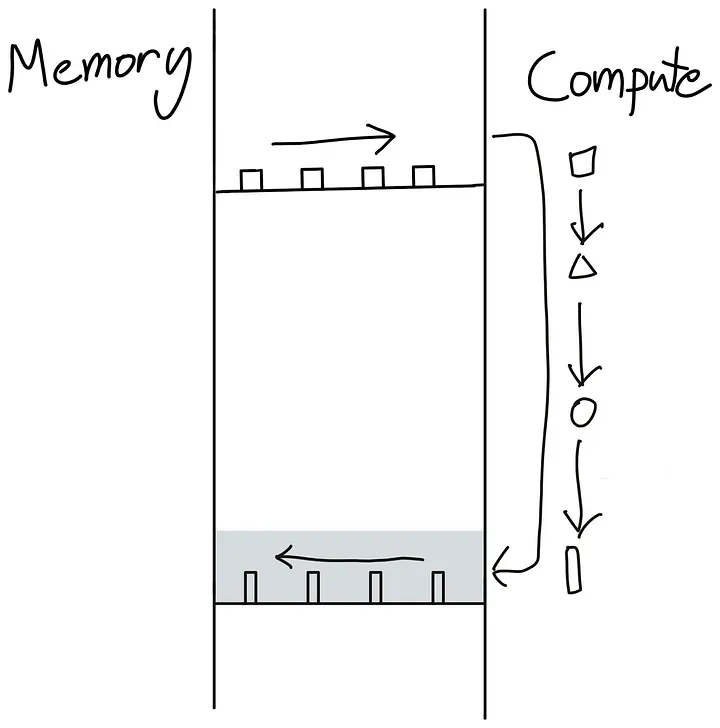

Instead of sending our triangle back to global memory just to read it back again, we do all of our operations in one go.

How can we avoid the back and forth shown on the left? Well, the best way is to make our GPU as autonomous as possible. This is achieved by packing as many successive compute operations as possible together in a single kernel for the GPU to run, called a “fused kernel,” as shown on the right.

Fused kernels are especially efficient and simple to write for successions of point-like operations that are performed independently of each other on each input token. In this case, there is no point in sending the computed values back to global memory before moving them to SM memory and spinning up a new kernel. It's much more efficient to keep all the values locally until all the computations have been performed.

In a Transformer model, this "fusing" approach can be applied every time we have a succession of point-wise operations, such as in the computations involved in the LayerNorm layers.

We now have all the understanding necessary to marvel at a true masterpiece of kernel engineering: ***FlashAttention***.

### FlashAttention

FlashAttention was introduced by [Tri Dao](https://tridao.me) and proposed to optimize attention computations by writing custom CUDA kernels to make them much faster *and* more memory efficient. The idea behind FlashAttention is to make efficient use of the various memories of the GPU to avoid relying too much on the slowest one: the global memory.

The global memory in modern GPUs often uses a technology called High Bandwidth Memory (HBM), which despite its name, is slower than SRAM in the GPU memory hierarchy. This HBM terminology will be important when we discuss the details of FlashAttention's implementation.

A basic implementation of the attention mechanism involves a lot of transfer between memory and workers. It requires materializing the **S** matrix (where S = QK^T, the attention scores) and the **P** matrix (where P = softmax(S), the normalized attention weights) in HBM, which means that the results need to be sent to HBM and then back to SRAM for the next computations:

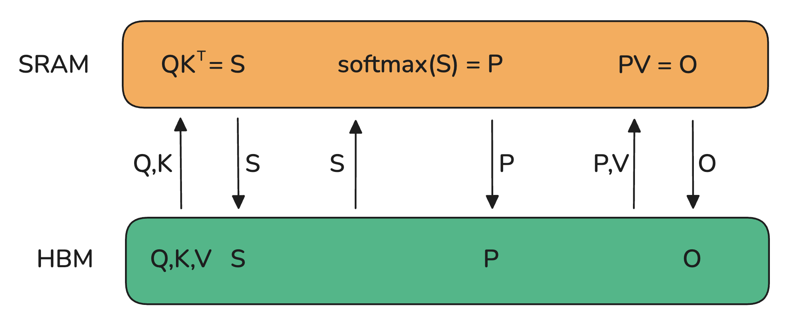

Since bandwidth is much lower in HBM, this introduces a severe bottleneck in the attention computation. Can we do better? [Tri Dao](https://upload.wikimedia.org/wikipedia/commons/b/b2/Hausziege_04.jpg) says yes!

The key element is to compute the **S** matrix in small pieces that can fit in the smaller shared memory of the SM. But we can do even better and avoid materializing the very large **S** matrix altogether, in favor of keeping only the necessary statistics for computing the normalization factor of the softmax. So, we can compute part of $O$ directly in one computation in SRAM rather than moving intermediate results back and forth. In this case, not only do we make use of the shared memory, but we also release the memory bottleneck resulting from materializing one of the largest activation matrices in the model (at long context length): the attention matrix.

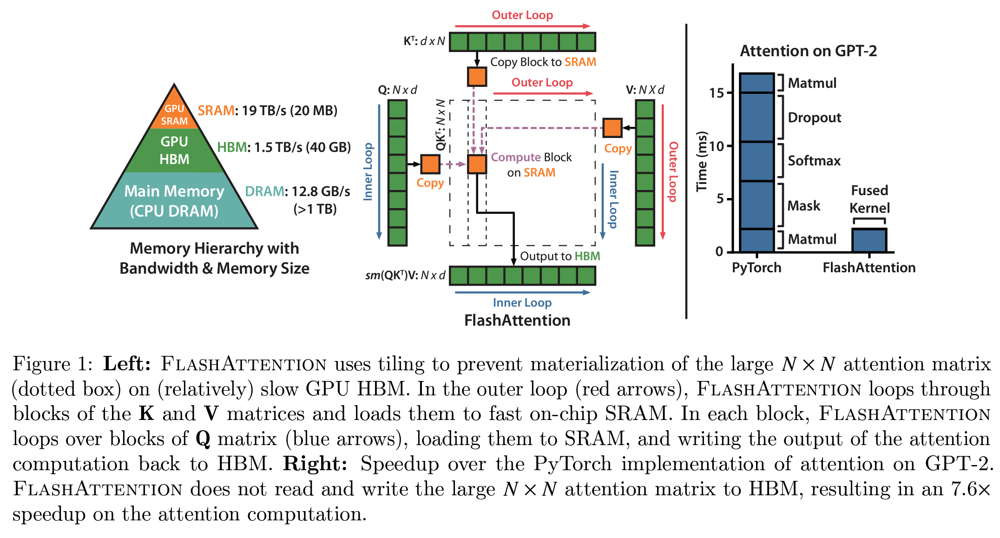

Source: FlashAttention paper[]

The idea of FlashAttention resolves so many bottlenecks in model training that it has quickly become the default way to perform attention in all transformers. Notably:

- By avoiding materializing the **S** matrix, we **reduce the memory burden of attention**.
- We also **remove a large part of the naive impact of the $O(S^2)$ cost of attention**.

All variants of linear attention and subquadratic approaches to approximate attention (developed shortly after the invention of the Transformer architecture) have mostly been put aside in favor of this exact and fast FlashAttention implementation and mechanism.

Following FlashAttention-1, two successive improved versions were released by the same lab: FlashAttention-2 and -3. In comparison to FlashAttention-1, the improvements in FlashAttention-2 and -3 are less about the general attention mechanism and more about tailoring its low-level implementation more specifically to the GPU by (1) reducing the number of non-matmul operations as much as possible, (2) carefully partitioning the workload among wraps and thread blocks (for FlashAttention-2), and (3) carefully optimizing for FP8 and Tensor Core support on the latest Hopper (H100) architecture for FlashAttention-3.

FlashAttention is a master demonstration of the breakthrough improvements that can come when you take into account the internal memory/compute design of current GPU accelerators.

The techniques described so far in this section have required us to implement modeling code changes and write custom kernels for certain operations in order to speed up training.

In the final section of our low-level dive into the compute operations themselves, we will take a look at a range of methods that are agnostic to the modeling code. They can be used for any model, and are so widely used that they have become standard in the industry: up next, ***mixed precision training***!

### Mixed precision training

In various sections of this book, we've talked about lower-precision formats and their impact on the memory requirements for storing activations, parameters, and optimizer states. It's now time to dive deeper into the details of these formats and get a better understanding of their trade-offs, advantages, and limitations.

Mixed precision training, as the name suggests, involves mixing different precisions when training. The default numerical precision of PyTorch tensors is *single-precision floating-point format*, also called *FP32* or *float32*, which means that every number stored takes up 32 bits, or 4 bytes. The available bits to represent a number are divided into three parts:

- Sign: the first bit determines if the number is positive or negative
- Exponent: controls the magnitude of the number
- Mantissa: determines the significant figures of the number

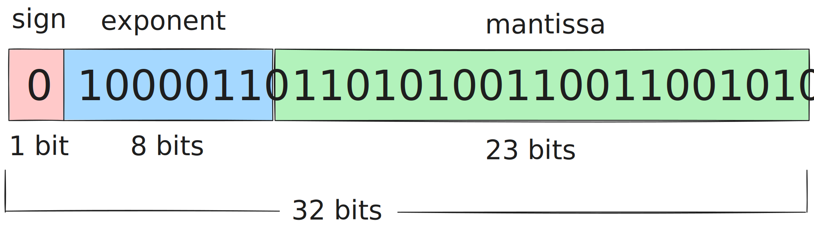

The principle of floating-point numbers can be easily illustrated by recalling the scientific notation of numbers, e.g. $- 5.734 \times 10^{7}$, where we first have the sign, followed by the mantissa and the exponent. As such, we can represent numbers across a wide range of magnitudes with an adaptive precision. Although float32 is the default, there are a range of floating-point formats available in PyTorch:

| **Format** | **Total bits** | **Sign** | **Exponent** | **Mantissa** |
| --- | --- | --- | --- | --- |
| float32 | 32 | 1 | 8 | 23 |
| float16 | 16 | 1 | 5 | 10 |
| bfloat16 | 16 | 1 | 8 | 7 |
| float8 (e4m3) | 8 | 1 | 4 | 3 |
| float8 (e5m2) | 8 | 1 | 5 | 2 |

Reducing the total number of bits comes at a price (no free lunch here either), but we have some control over how to pay: we can sacrifice bits in either the mantissa or the exponent. For this reason, there also exist two float8 (FP8) formats, named according to the exponent and mantissa, so we can flexibly choose the most appropriate format. Let's take a look at the possible range of numbers for each format:

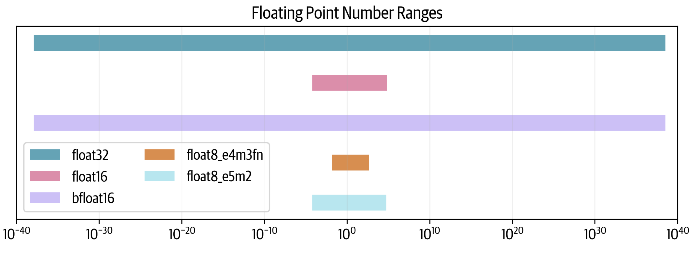

We can see that float32 spans 80 orders of magnitude, and float16 sacrifices a lot of range while bfloat16 maintains the full range. The two float8 formats reduce the range even further: e5m2 can maintain the float16 range, but e4m3 has an even smaller range.

How come some formats are able to maintain the full range while others aren't? Let's investigate their resolutions by plotting 10,000 points between 1 and 2. Each point will be rounded to the nearest representable number in each format:

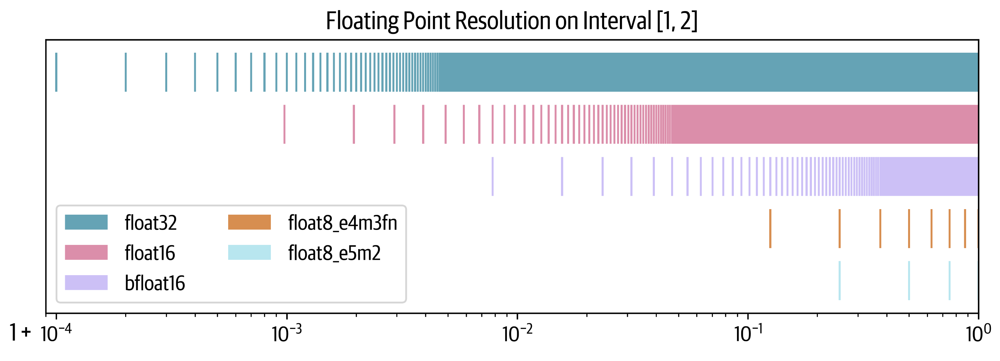

We can see here that although bfloat16 maintains the range of float32 (unlike float16), it does this at the cost of sacrificing more precision. In the case of float8 the situation is even more dire: e4m3 can represent only 7 and e5m2 only 3 numbers in the interval [1,2].

A common metric to measure a format's resolution is *epsilon*: the first representable number after $1.00$. We can see that for the float32 format, $10^{-4}$ is an upper bound (it’s actually $1.19^{-7}$). For float16 it's ~$10^{-3}$, and for bfloat it's 10x higher still.

The idea of mixed precision training is to use some of these lower-precision formats for certain computations while maintaining the performance of full precision training. As it turns out, we **can’t** totally abandon float32 and usually will need to do some of the computations in full precision.

Let’s now take a look at training models with 16 bits and then see if we can take it a step further, all the way down to 8 bits.

#### FP16 and BF16 training

Naively switching all the tensors and operations to float16 unfortunately doesn’t work, and the result is usually diverging losses. However, the original mixed precision training paper[] came up with three tricks to match float32 training:

1. **FP32 copy of weights:** There are two possible issues with FP16 weights. During training, some of the weights can become very small and will be rounded to 0. However, even if the weights themselves are not close to 0, if the updates are very small the difference in magnitude can cause them to underflow during the addition. Once the weights are 0, they will remain at 0 for the rest of training as there is no gradient signal coming through anymore.
2. **Loss scaling:** We have a similar issue with the gradients as well, as gradients tend to be much smaller than 1 and are thus at risk of underflow. A simple yet effective strategy is to scale the loss before the backward pass and unscale the gradients after the backward pass. This ensures that there is no underflow during the backward pass, and the scaling does not affect training because we unscale before processing the gradients further (e.g., clipping) and the optimization step.
3. **Accumulation:** Finally, when performing certain arithmetic operations in 16-bit precision (such as averages or summations), we can also face under- or overflows. A solution then is to accumulate intermediate results in FP32 during the operation and only cast the final result back to 16-bit precision.

With these techniques, we can get stable training while benefitting from higher throughput due to the faster, lower-precision arithmetic operations.

Naturally, as a curious reader – and by now slightly addicted to maximizing the throughput – you may ask the question: Can we go further and faster than 16-bit precision?

Maybe!

#### FP8 pretraining

Even if we perfectly overlap communication with computation, we always eventually run into the low-level theoretical FLOPS limit of the hardware itself - i.e., the efficiency of each individual operation on our hardware. This is where numerical precision becomes crucial. For instance, on NVIDIA's H100 GPU, FP8 matrix multiplications (GEMM operations) achieve twice the theoretical FLOPS of BF16, making lower-precision training an attractive path for further optimization.

Recent research - including FP8-LM[], torchao[], and DeepSeek-V3[] - has demonstrated the potential of FP8 training for large-scale models. Still, FP8 pretraining introduces a significant challenge: **stability**. At lower precision, numerical instability often leads to loss divergence, making it difficult to match the accuracy of higher-precision training.

We know that instability increases as learning rates rise for a fixed model size[], making FP8 pretraining particularly tricky.

Here is an example of a typically divergent loss curve for FP8 training:

<iframe src="assets/data/fp8/fp8_training_loss_curves.html" width="100%" height="400" frameborder="0"></iframe>

*[Open interactive visualization](assets/data/fp8/fp8_training_loss_curves.html)*

The first successful very large scale training with FP8 mixed precision was publicly reported in the DeepSeek-V3 technical report[]. The authors carefully analyzed each operation of the forward pass (*Fprop*) as well as the activation (*Dgrad*) and weight (*Wgrad*) backward passes. Similar to BF16 mixed precision training, some aggregations and master weights are kept in higher precision while the operations themselves are performed in FP8.

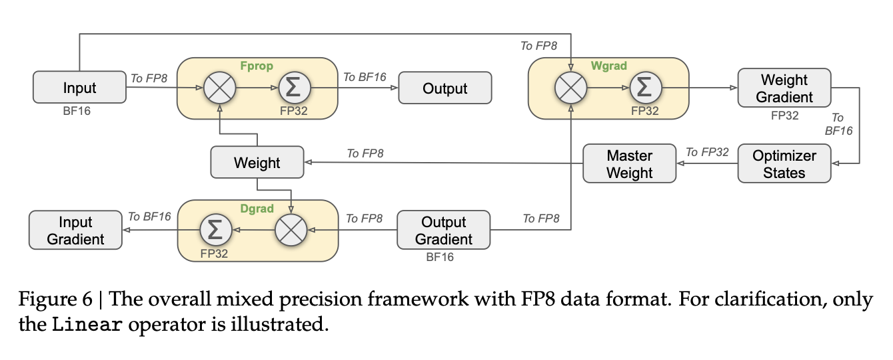

In order to switch from high precision (e.g., FP32 or BF16) to lower precision (e.g., FP16 or FP8) with a smaller range, we need to normalize the range of activation values, for instance by computing their absolute maximum. DeepSeek-V3 further introduced a specific quantization scheme where the ranges are normalized per tile: 1x128 for inputs/activations and 128x128 for weights and scale elements. This makes the normalization less strongly impacted by outlier values in the activations. The authors also proposed a number of additional tricks to further reduce the memory and communication footprint, which you can read about in section 3.3 of the technical report[].

Here’s a summary of a few known approaches to FP8 training:

|  | GEMM's precision | Master model weights | Accumulated gradients | Model weights | Gradients | Optimizer states | Total memory |
| --- | --- | --- | --- | --- | --- | --- | --- |
| BF16 with FP32 mixed precision baseline | BF16 | FP32 | FP32 | BF16 | BF16 | FP32 + FP32 | 4 + 4 + 2 + 2 + 4 + 4 = 20 bytes |
| The above without FP32 grad accumulation | BF16 | FP32 | n/a | BF16 | BF16 | FP32 + FP32 | 4 + 2 + 2 + 4 + 4 = 16 bytes (20% reduction) |
| Transformer engine | FP8 | n/a | n/a | FP32 | FP32 | FP32 + FP32 | 4 + 4 + 4 + 4 = 16 bytes (20% reduction) |
| FP8-LM's O3 level | FP8 | FP16 | FP16 | FP8 | FP8 | FP8 + FP16 | 2 + 2 + 1 + 1 + 1 + 2 = 9 bytes (55% reduction) |
| DeepSeek-V3 | FP8 | FP32 | FP32 | FP8 | BF16 | BF16 + BF16 | 4 + 4 + 1 + 2 + 2 + 2 = 15 (25% reduction) |
| Nanotron's FP8 | FP8 | BF16 | FP32 | FP8 | FP8 | FP8 + FP8 | 2 + 4 + 1 + 1 + 1 + 1 = 10 bytes (50% reduction) |

Overall, FP8 remains (in early 2025) an experimental technique, and methods are still evolving. Given its obvious benefits, it will likely become the standard and soon replace BF16 mixed precision. To see an open source implementation of FP8 training techniques, check out [this Nanotron PR](https://github.com/huggingface/nanotron/pull/70).

Projecting further into the future, Blackwell, the next generation of NVIDIA chips, [have been announced](https://www.nvidia.com/en-us/data-center/technologies/blackwell-architecture/) to support FP4 training, further speeding up training but without a doubt also introducing a new training stability challenge.

This last section concluded our long journey into the land of fast and large model training on tens to thousands of GPUs. Time to slowly bring our GPU cluster to rest and take a step back to reflect on all we've learned along the way!
