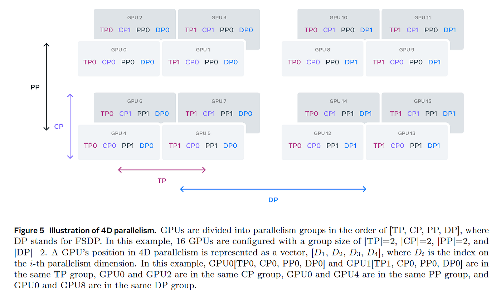

# Conclusion

*From [The Ultra-Scale Playbook](https://huggingface.co/spaces/nanotron/ultrascale-playbook)*

## Conclusion

Congratulations, dear reader, you made it to the end! We've completed quite a journey: we started with exploring how to train a simple model on a single GPU and went all the way to mastering various intricate techniques used to efficiently train massive language models like Llama-405B and DeepSeek-V3 on thousands of GPUs. By now, you can read a diagram like Llama-3's 4D parallel setup with (relative) ease:

Orchestrating large clusters of GPUs to train LLMs efficiently is no easy feat, but you've learned how to optimize computations and communications between GPUs such that they run with maximum utilization at all times. As you've seen, this involves choosing the right parallelization strategy for a given model and cluster size, overlapping communication and computation where possible, and writing custom kernels that take into account the hardware layout to perform an operation as fast as possible on the GPU.

You might still believe that this knowledge is a bit niche and only concerns the small set of people that pretrain LLMs. Historically, that may have been true, but as both the [AI builder community](https://huggingface.co) and model sizes are growing rapidly, the community of people using distributed techniques for inference, fine-tuning, and training is increasing exponentially as well, making distributed training setups more and more common. Diving deeper into all things distributed might thus prove very timely.

This has been a long learning journey, and not just for you! Running thousands of benchmarks on a GPU cluster was more challenging than we anticipated, and we wanted to share a few highlights of our own learning experience as well.

### So, what’s next?

You now have a good overview of the main distributed training concepts, but we just scratched the surface of several of these tools and techniques. There are many ways to dive deeper into a given subject, but here are some steps that we recommend:

- Carefully read some of the landmark or very recent papers. You can find an extensive list of the most impactful papers, blog posts, and books we know of in the [References](#references).
- Start from scratch and implement an algorithm yourself. Often, a method only fully “clicks” if you've actually implemented it.
- Dive into one of the widely used frameworks and start contributing: fix bugs, answer issues, or implement a new feature. That’s the best way to get into any ML field!

We hope this book helps you get started with distributed training, and that you will train the next generation of awesome models to the hum of your GPU cluster! May the force of open source and open science always be with you.

### Acknowledgments

We thank [Elie](https://huggingface.co/eliebak) for conducting thorough reviews and creating the audio components using NotebookLM. Special thanks to [Hynek](https://huggingface.co/hynky) for optimizing the frontend performance. We also thank [Simon](https://huggingface.co/sbrandeis) for resolving some issues on the hub.

### Discussion page

If you want to discuss the content of this book, ask questions, propose changes, or just say hi, please open a thread on the [discussion page](https://huggingface.co/spaces/nanotron/ultrascale-playbook/discussions).
