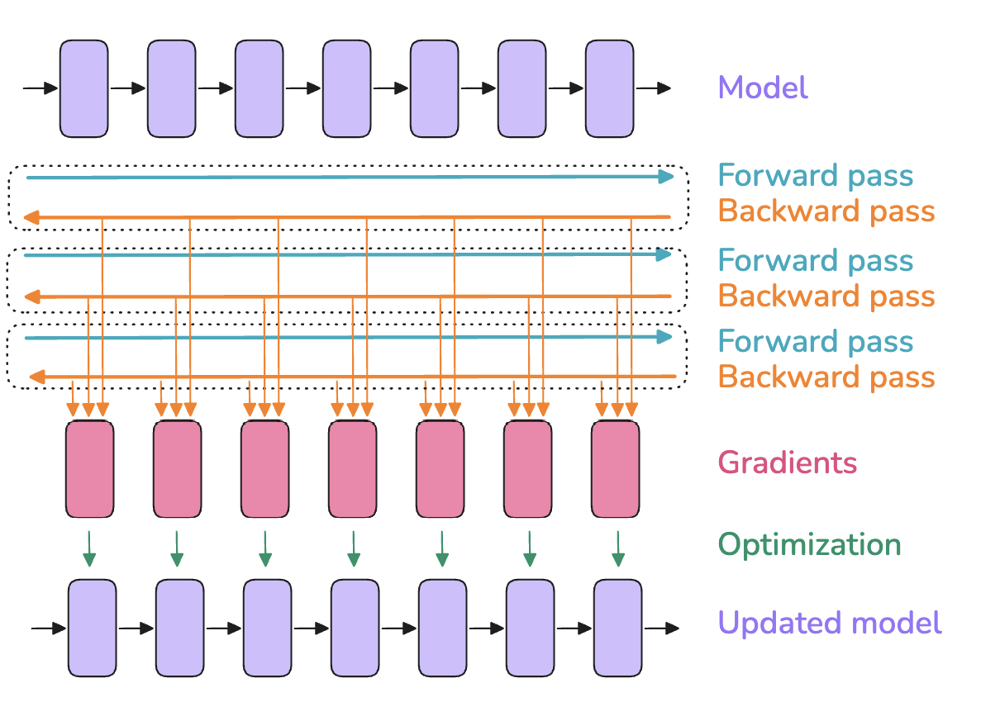
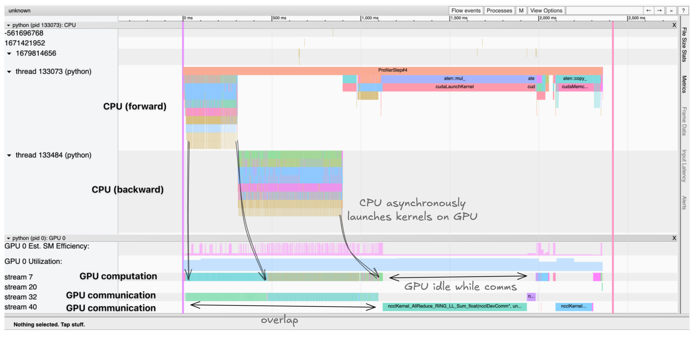

# First Steps: Training on One GPU

*From [The Ultra-Scale Playbook](https://huggingface.co/spaces/nanotron/ultrascale-playbook)*

## First Steps: Training on One GPU

If you fancy adding a podcast feeling to your reading experience, feel free to listen to the NotebookLM hosts discussing the first sections of this book as you're reading along.

Let’s start by quickly reviewing the very basics of model training before we start to scale to many GPUs. When a model is trained on a single GPU, the training typically consists of three steps:

1. A forward pass, which passes inputs through the model to yield its outputs
2. A backward pass to compute the gradients
3. An optimization step using the gradients to update the parameters

It looks generally like this:

In this figure, the boxes on the top line can be seen as successive layers inside a model (and the same for the last line). The pink boxes are the associated gradients for each of these layers, computed during the backward pass.

The ***batch size*** ($bs$) is one of the important hyperparameters for model training; it affects both model convergence and throughput.

A small batch size can be useful early in training to quickly move through the training landscape to reach an optimal learning point. However, further along in the model training, small batch sizes will keep gradients noisy, and the model may not be able to converge to the most optimal final performance. At the other extreme, a large batch size, while giving very accurate gradient estimations, will tend to make less use of each training token, rendering convergence slower and potentially wasting compute resources. You can find a nice early discussion of this topic in OpenAI’s paper on large batch training[], or in section 4.2 of the MiniMax-01 [technical report](https://filecdn.minimax.chat/_Arxiv_MiniMax_01_Report.pdf).

Batch size also affects the time it takes to train on a given text dataset: a small batch size will require more optimizer steps to train on the same amount of samples. Optimizer steps are costly (in compute time), and the total time to train will thus increase compared to using a larger batch size. That being said, note that the batch size can often be adjusted quite widely around the optimal batch size without major impact on the performance of the model - that is, the sensitivity of final model performance to the exact batch size value is usually rather low around the optimal batch size.

In the LLM pretraining community, batch sizes are commonly reported in terms of tokens rather than number of samples ($bst$ = batch size tokens). This makes training numbers generally independent of the exact input sequence length used during the training.

In the simplest case, training on a single machine, the $bs$ (in samples) and $bst$ can be computed from the model input sequence length ($seq$) as follows:

$$bst=bs *seq$$

From here onward we’ll show the formulas for the batch size in terms of samples, but you can always get its token unit counterpart by multiplying it with the sequence length.

A sweet spot for recent LLM training is typically on the order of 4-60 million tokens per batch. The batch size and the training corpus size have been steadily increasing over the years: Llama 1 was trained with a batch size of ~4M tokens for 1.4 trillion tokens, while DeepSeek was trained with a batch size of ~60M tokens for 14 trillion tokens.

We run into our first challenge when scaling the training of our model to these large batch sizes: ***out-of-memory (OOM) issues***. What should we do when our GPU doesn’t have enough memory to hold a full batch of our target batch size?

Let’s start by exploring what leads to the OOM issues in the first place. This will help us gain some useful intuitions on the memory requirements for training a model.

### Memory usage in transformers

When training a neural network model, we store several items in memory:

- Model weights
- Model gradients
- Optimizer states
- Activations needed to compute the gradients

📝 Note

You might think that you could compute the memory requirements for a model exactly, but there are a few additional memory occupants that make it hard to be precise:
        
CUDA kernels typically require 1-2 GB of GPU memory, which you can quickly verify by running `import torch; torch.ones((1, 1)).to("cuda")` and then checking the GPU memory with `nvidia-smi`.
Some memory is used for buffers and intermediate results, and there's some memory that can't be used due to fragmentation.

        We’ll neglect these last two contributors, as they are typically small and constant factors.

These items are stored as tensors, which come in different shapes and precisions. The *shapes* are determined by hyperparameters such as batch size, sequence length, model hidden dimensions, attention heads, vocabulary size, and potential model sharding, as we’ll see later. *Precision* refers to formats like FP32, BF16, or FP8, which respectively require 4, 2, or 1 byte to store each single value in the tensor. We will have a full discussion of the different precisions and their trade-offs in the ["Mixed precision training"](#mixed_precision_training) section; for now, let's just keep in mind that the memory requirements for these various formats will be different, and that will impact the memory usage of the items we need to store.

So how can you quickly determine memory usage from these variables? One simple way is to do this empirically and just measure it.

#### Profiling the memory usage

Using the PyTorch profiler, we can understand how memory is allocated throughout training. We can see that memory utilization is not a static thing, but varies widely during training and during a training step:

<iframe src="https://nanotron-ultrascale-playbook.static.hf.space/fragments/memory-profile.html" width="100%" height="450" frameborder="0" scrolling="no"></iframe>

*[Open full interactive visualization: Memory-Profile](https://nanotron-ultrascale-playbook.static.hf.space/fragments/memory-profile.html)*

Clearly the first step looks very different from the subsequent ones, but before we get to that, let’s take a look at the general anatomy of a step. First the activations increase quickly as we do the forward pass, then during the backward pass the gradients build up, and as the backward pass propagates, the stored activations used to compute the gradients are progressively cleared. Finally, we perform optimization, during which we need all the gradients, and then update the optimizer states before we start the next forward pass.

As mentioned, the first step looks different: the activations increase quickly and then plateau for a while. Why? In this first step, the PyTorch caching allocator does a lot of prep work, preparing memory allocations so that the subsequent steps don’t have to search for free memory blocks, which speeds them up (see [Zach’s blog](https://zdevito.github.io/2022/08/04/cuda-caching-allocator.html)). After the first step we also see the optimizer states appearing, which generally offset the memory usage for further training steps.

Now that we have a first view of memory, let’s see how scaling up training is often a question of maximizing compute efficiency while keeping the memory requirements of these various items (activations, parameters, gradients, optimizer states) within the memory constraints of the GPUs.

#### Memory for weights/grads/optimizer states

Let's start with the first three items in our list: the model’s weights, gradients, and optimizer states. We can actually pretty easily estimate the memory needed for them.

For a simple transformer LLM, the number of parameters is given by the [following formula](https://michaelwornow.net/2024/01/18/counting-params-in-transformer):

$$N = h * v + L * (12 * h^2 + 13 * h) + 2*h$$

In that equation, $h$ is the hidden dimension, $v$ the vocabulary size, and $L$ the number of layers in the model. Note that looking at the equation, we can see that the term that will dominate with large hidden dimensions is the $h^2$ term, since it’s the only one growing quadratically as we scale the parameters.

Memory requirements for the parameters and gradients are determined simply by multiplying the number of parameters by the number of bytes per parameter. In good old-fashioned full precision (FP32) training, both parameters and gradients require 4 bytes while the optimizer, if we use Adam, requires the momentum and variance to be stored, adding another 8 bytes per parameter (4 bytes each). In summary:

$$\begin{aligned}
            & m_{params} = 4 * N \\
            & m_{grad} = 4 * N \\
            & m_{opt} = (4+4) * N
            \end{aligned}$$

Now, let’s have a look at how things change if we use a lower precision. For stability reasons (see the section on [mixed precision training](#mixed_precision_training) later in the book), we often don't use full low precision training but a mix of higher and lower precision called "mixed precision"[]. The default nowadays for mixed precision training is to generally use BF16 for most of the computations – requiring 2 bytes per parameter and gradient – as well as storing an additional copy of the model weights and gradients in FP32, making 12 bytes per parameter in total. In addition to the parameters and gradients, we need to store the optimizer states; for the Adam optimizer, this requires the momentum and the variance, usually stored in FP32 for numerical stability, each using 4 bytes.

Here’s the summary:

$$\begin{aligned}
                & m_{params} = 2 * N \\ 
                & m_{grad} = 2 * N \\ 
                & m_{params\_fp32} = 4 * N  \\ 
                & m_{opt} = (4+4) * N
            \end{aligned}$$

📝 Note

Some libraries store grads in FP32, which would require an additional $m_{params\_fp32} = 4 * N$ memory. This is done, for example, in Nanotron, because BF16 is lossy for smaller values and we always prioritize stability. See  [this DeepSpeed issue](https://github.com/microsoft/DeepSpeed/issues/1773) for more information.

📝 Note

The FP32 copy of the parameters ($m_{params\_fp32}$) is sometimes called the "master weights" in the literature and codebases.

Interestingly, mixed precision training itself doesn’t save memory; it just distributes the memory differently across the three components, and in fact adds another 4 bytes over full precision training if we accumulate gradients in FP32. It’s still advantageous, though, as computing the forward/backward passes in half precision (1) allows us to use optimized lower precision operations on the GPU, which are faster, and (2) reduces the activation memory requirements during the forward pass, which as we saw in the graph above is a large part of the memory usage.

Let’s get a general sense of how much memory we need for a model (with full and mixed precision giving the same overall values):

| **Model parameters** | **FP32 or BF16 w/o FP32 grad acc** | **BF16 w/ FP32 grad acc** |
| --- | --- | --- |
| 1B | 16 GB | 20 GB |
| 7B | 112 GB | 140 GB |
| 70B | 1120 GB | 1400 GB |
| 405B | 6480 GB | 8100 GB |

Using FP8 training instead of BF16 would further decrease the memory usage, but it is less stable. This is a very active research topic (see [this tweet](https://x.com/xariusrke/status/1826669126955278401)), and we’ll cover it in more detail later.

As we can see, as soon as we reach **7B**(!), the memory requirements for the weights, gradients, and optimizer states already start to add up significantly and exceed the size of a typical GPU's memory (e.g., 80 GB for an H100 GPU).

But for now, let’s stick with models that fit in a single GPU and take a look at the last big contributor to our memory budget: the activations.

#### Memory for activations

The memory requirements for activations are a bit more complex to compute than for the weights, gradients, and optimizer states, in part because they depend on the inputs of the model. If you’re unsure why we even need to store activations for the backward pass, [this blog post](https://www.determined.ai/blog/act-mem-2) gives a good quick refresher. After a careful inspection of how the backward pass is computed, we can estimate the total memory required for the activations in mixed precision. We arrive at the following equation:

$$m_{act} =  L \cdot seq \cdot bs \cdot h \cdot (34 + \frac{5 \cdot n_{heads} \cdot seq}{h})$$

Here, $L$ is the number of layers, $seq$ the sequence length, $bs$ the batch size in samples, $h$ the hidden dimension of the model, and $n_{heads}$ the number of heads.

For the exact derivation of the numbers, you can follow the original NVIDIA paper on recomputation [] - it essentially requires you to do some accounting of all the sizes of intermediate activations between each operation in a transformer layer.

An interesting observation here is that memory usage is not static for a given model; rather, it scales linearly with the batch size and quadratically with the sequence length. This means the activation memory is the part that will blow up when we increase our batch size or train with longer sequences. We can use this equation to look at how memory usage changes for various sequence lengths, for example for Llama models (`bs=1`):

<iframe src="https://nanotron-ultrascale-playbook.static.hf.space/fragments/memusage_activations.html" width="100%" height="450" frameborder="0" scrolling="no"></iframe>

*[Open full interactive visualization: Memusage Activations](https://nanotron-ultrascale-playbook.static.hf.space/fragments/memusage_activations.html)*

These graphs tell a striking story: for short sequences (or small batch sizes), memory usage for activations is almost negligible, but from around 2-4k tokens they start to take up a significant amount of memory, while usage for parameters, gradients, and optimizer states (as we’ll discuss later) is roughly independent of the sequence length and batch size.

For large numbers of input tokens (i.e., large batch sizes/sequences), activations become by far the largest memory burden.

Is there a way to tame this “activation explosion”? Good question, reader!

It’s time to explain our first technique, called ***activation recomputation***, which will help us cap the activation memory footprint - it's an essential tool in today’s large model training toolbox.

### Activation recomputation

The general idea behind activation recomputation – also called *gradient checkpointing* or *rematerialization* – is to discard some activations during the forward pass to save memory and spend some extra compute to recompute these on the fly during the backward pass. Without recomputation, we store every hidden state between two learnable operations (e.g., feedforward, LayerNorm, etc.), so that we can use them during the backward pass to compute gradients. When we use recomputation, we typically only store activations at a few key points in the model architecture, discarding the rest of the activations and recomputing them on the fly during the backward pass from the nearest saved activations. Basically, we perform a sub-part of the forward pass again, to trade off memory for compute. It generally looks like this:

There are a few strategies for selecting key activations to store:

- **Full:** We checkpoint activations at the transition point between each layer of the Transformer model. This is usually called the “full” strategy since it requires a forward pass through each layer, essentially adding a full forward pass during the backward pass. This strategy saves the most memory but is the most expensive one in terms of compute. It typically increases the compute cost and time by up to 30-40%, which is very noticeable.
- **Selective:** In general, we can do better than full. The authors of the recomputation paper[] did a detailed analysis studying which activations grow the largest and have the cheapest recomputation cost in terms of floating-point operations per second (FLOPS). It turns out that the attention computations fall in that category, and thus we can usually discard them and focus on checkpointing the expensive feedforward computations. For a GPT-3 (175B) model, this means **a 70% activation memory reduction at a 2.7% compute cost**.

Let’s see how drastically recomputation strategies can reduce the memory footprint in practice, and how selective recomputation strikes a nice balance between memory savings and recomputation cost:

<iframe src="https://nanotron-ultrascale-playbook.static.hf.space/fragments/memory-recomputation.html" width="100%" height="450" frameborder="0" scrolling="no"></iframe>

*[Open full interactive visualization: Memory-Recomputation](https://nanotron-ultrascale-playbook.static.hf.space/fragments/memory-recomputation.html)*

Another trend that's clearly visible here is how the activations for long sequences play a bigger role for smaller models, so the effect of recomputation becomes even more noticeable.

📝 Note

When you're measuring how efficient your training setup is at using your GPU/TPU/accelerator, you usually want to take recomputation into account to compute total FLOPs (floating-point operations) and compare this to the theoretical maximum FLOPS (floating-point operations per second) of the GPU/TPU/accelerator. Taking recomputation into account when calculating FLOPs for a training step gives a value called "hardware FLOPs," which is the real number of operations performed on the accelerator. Dividing this hardware FLOPs value by the duration of the training step (in seconds) gives you the actual FLOPS achieved. Then, dividing this achieved FLOPS by the maximum accelerator FLOPS yields the ***hardware FLOPS utilization (HFU)***.

However, what really matters at the end of the day is the total time needed to train a model on a given dataset. So, for example, when comparing various GPUs/TPUs/accelerators, if one of these provides enough memory to skip recomputation and thus performs fewer total operations (lower hardware FLOPs) but still trains faster, it should be rewarded, not punished. Thus, an alternative is to compute what is called ***model FLOPS utilization (MFU)***, which, in contrast to HFU, only takes into account the required operations for the forward and backward passes through the model and does not include recomputation in the measured FLOPs. This value is thus more specific to the model than the training implementation.

Most training frameworks these days use FlashAttention (covered further [later in the book](#flash_attention_1-3)), which natively integrates activation recomputation in its optimization strategy by recomputing attention scores and matrices in the backward pass instead of storing them. Thus, most people using FlashAttention are already making use of selective recomputation.

As you’ve now understood, activation recomputation slightly increases the number of FLOPS due to recomputation, while it significantly reduces memory access overhead.

This trade-off is particularly advantageous on hardware with limited high-speed memory, like GPUs, as accessing memory is typically slower than performing computations. Despite the additional operations involved, the overall effect is thus often faster computation, in addition to the much lower memory footprint.

Now that we’ve learned about recomputation, we can tame the activation memory usage we saw in the previous graphs!

However, activations still have a linear dependence on the batch size, and all our profiles in the bar plots above were using `bs=1`, so as we move to larger batch sizes this might become an issue again. Fortunately, we have a second tool in our box - ***gradient accumulation*** to the rescue!

### Gradient accumulation

Gradient accumulation is a very straightforward method to avoid memory explosion that consists of splitting a batch into micro-batches. We then perform forward and backward passes successively on each micro-batch, compute the gradients, and, as the name suggests, sum the gradients of all micro-batches before we perform optimization. In practice, the optimization step is conducted not on the sum but on the average of the gradients, so that the result is independent of the number of gradient accumulation steps.

Let’s call the batch size for each forward pass the *micro-batch size* ($mbs$). We’ll refer to the overall batch size between each optimizer step as the *global batch size* ($gbs$). If we do one optimizer step for each eight forward/backward passes, the global batch size will be eight times the micro-batch size.

What we now call the global batch size thus corresponds to what we’ve called just the batch size up to this point, for simplicity (we're now making our terms more precise to avoid ambiguity).

With gradient accumulation, the global batch size can be computed as follows:

$$bs = gbs = mbs \times grad\_acc$$

Gradient accumulation allows us to effectively increase our batch size up to infinity (and beyond!) while the memory footprint stays constant. Gradient accumulation is also compatible with activation recomputation for further memory reductions.

Gradient accumulation allows us to reduce activation memory, which grows linearly with batch size, by processing smaller micro-batches sequentially. This reduces stored activations and gradients since only one micro-batch's worth of activations needs to be kept in memory at a time, which helps reduce the overall activation memory footprint.

One drawback, however, is that gradient accumulation requires multiple consecutive forward/backward passes per optimization step, thereby increasing the compute overhead and slowing down training. No free lunch!

If you’ve been following carefully, though, you probably noticed that the forward/backward passes for each micro-batch can actually be run in parallel. Forward and backward passes are independent from each other, with independent input samples being the only difference. Seems like it’s time to start extending our training to more than one GPU!

Before that, let's quickly see how we can visualize computation and communication with a short tour of one of the most useful tools in the distributed training toolbox: the ***profiler***. This tool will be extremely useful to understand and validate how communications between GPUs and compute are happening and where the bottlenecks are.

#### Profiling GPU compute and communication

PyTorch's [profiler](https://pytorch.org/tutorials/recipes/recipes/profiler_recipe.html) allows us to trace and visualize exactly what's happening on both the CPU and the GPU during training. It's natively integrated in PyTorch. Let's see how to use it:

This generates a trace that we can visualize in TensorBoard or Chrome's trace viewer. The trace shows:

- A CPU threads launching kernels asynchronously on the GPU
- Multiple CUDA streams handling compute and communication in parallel
- Kernel execution times and memory allocation

Example trace showing a CPU threads launching kernels asynchronously on the GPU, with compute kernels and communication happening in parallel across different CUDA streams

The trace helps identify bottlenecks like:

- Sequential compute and communication that could be overlapped
- Idle GPU time waiting for data transfers
- CUDA Syncs and memory movement between CPU and GPU
- Kernel launch overhead on the GPU

Understanding these patterns is crucial for optimizing distributed training performance. For example, the trace will clearly show if gradient synchronization is properly overlapped with backward computation, as we'll discuss later.

Now let’s get a larger workstation with a couple of GPUs and start investigating our first scaling technique, called ***data parallelism*** - which, as we'll see, is just a parallel version of gradient accumulation.
