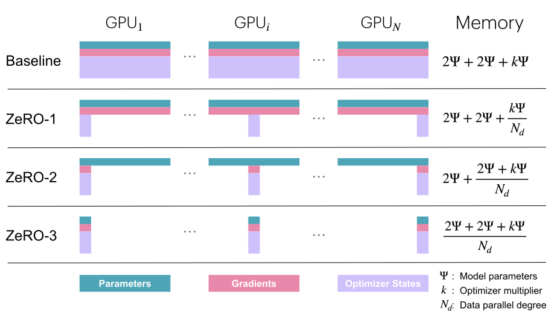
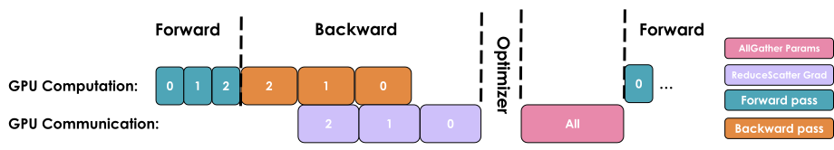
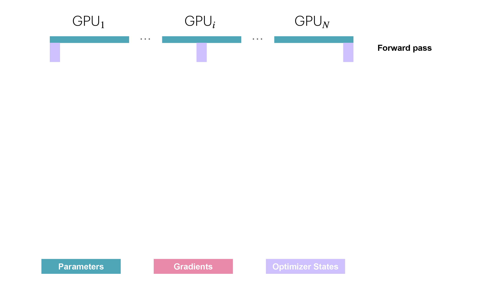
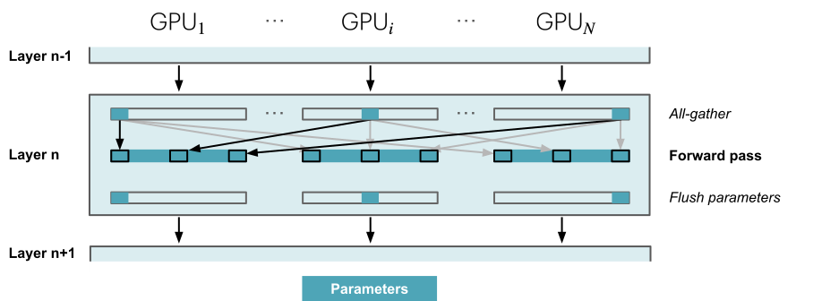

# Data Parallelism

*From [The Ultra-Scale Playbook](https://huggingface.co/spaces/nanotron/ultrascale-playbook)*

## Data Parallelism

To add a podcast feeling to your reading experience, feel free to listen to the NotebookLM hosts discussing the following sections of this book as you're reading along.

The idea behind data parallelism (DP) is to replicate the model on several GPUs (we call the replicas “model instances”) and run forward and backward passes on different micro-batches of data in parallel on each GPU - hence the name *data parallelism*. You've probably already seen data parallelism in simple training examples, but we'll dive quite a bit deeper in this section, so stay tuned even if you know the general approach.

Using a different micro-batch for each GPU means we’ll have different gradients on each GPU, so to keep the model instances in sync across the different GPUs, we'll average the gradients from the model instances using an operation called “all-reduce.” This operation takes place during the backward pass, before the optimizer step.

This involves our first “distributed communication” primitive, ***all-reduce***, which handles the synchronization and communication between GPU instances and nodes.

A naive DP implementation would just wait for the backward pass to finish so that we have all the gradients, then trigger an all-reduce over all the DP ranks to sync the gradients. But such sequential steps of computation followed by communication are **A BIG NO-NO** because we don’t want our GPUs to stay idle while communication is happening, like in the above image.

Instead, we should try to overlap communication and computation whenever possible so that they happen at the same time.

Let’s take a look at three optimizations that allow us to do much better than our naive first implementation.

#### First optimization: Overlap gradient synchronization with backward pass

The main drawback of the naive DP approach we’ve just described is that after the backward pass (*computation*), we have to wait for gradient synchronization (*communication*) before updating the parameters. Could we overlap this communication with our computation? The answer is yes!

As shown in the figure above, the gradients (pink boxes) for a layer can be gathered and summed even before the gradients from earlier layers (the pink boxes to their left) have been computed. For example, as soon as the backward pass of the last layer is complete (the last box on the right), those gradients can already be gathered and summed while the backward computations continue for earlier layers, moving toward the left.

This can be achieved in PyTorch by attaching an *all-reduce hook function* to each parameter. An all-reduce operation is then triggered as soon as the gradient for that parameter is ready, while the gradients for other parameters are still being computed. This approach overlaps most of the all-reduce operations with gradient calculations, thereby improving efficiency. Here's a simple function to attach a hook:

Overlapping computation and communication reduces the time spent waiting for gradient synchronization across the entire model. Gradient synchronization can occur (at least partially) in parallel with the backward pass within the same training step, significantly speeding up data parallelism. Here's a full implementation of naive DP with synchronization overlap:

👉 Naive DP implementation with overlap in Picotron (click to expand)

This is our first example of the concept of overlapping computation and communication, an essential technique for maximizing scaling efficiency that we will discuss several times in this book. But we can improve the efficiency even further!

#### Second optimization: Bucketing gradients

GPU operations are usually more efficient when performed on large tensors, rather than having many operations running on smaller tensors. This is also true for communication operations. Thus, we can advantageously group gradients into “buckets” and launch a single all-reduce for all the gradients within the same bucket instead of performing independent all-reduce operations for each gradient. It will generally look like the following:

Think of it like packing items into boxes before shipping them. It's more efficient to send a few big boxes than many small ones. By performing a single all-reduce operation for each bucket, we can significantly reduce the communication overhead and speed up the communication operation.

Here's a code implementation with bucketing:

👉 Bucket DP implementation in Picotron (click to expand)

#### Third optimization: Interplay with gradient accumulation

Finally, as we’ve seen, gradient accumulation works by performing multiple forward and backward passes before updating the parameters with `optimizer.step()`. When combining gradient accumulation with data parallelism, we should be careful when we want to synchronize gradients.

In a naive version, an all-reduce operation is automatically triggered after each backward pass during the accumulation. This is suboptimal, as a single reduce after the final step would have the same effect while reducing overhead.

In PyTorch, this is typically solved by adding a [`model.no_sync()`](https://github.com/pytorch/pytorch/blob/5ea67778619c31b13644914deef709199052ee55/torch/nn/parallel/distributed.py#L1408-L1435) decorator, which disables gradient synchronization, on the backward passes that don’t need reduction.

📝 Note

When performing communication operations, tensors must be contiguous in memory to avoid redundant memory copies. To perform this optimally, we often preallocate continuous buffers of the size of the activations or model parameters specifically for communication. While this speeds up communication, it also contributes in part to the peak memory usage during training.

Now, let's have a look what this means for the global batch size.

### Revisiting global batch size

We can update our batch size equation with our newly added data parallelism and gradient accumulation parameters:

$$bs = gbs = mbs \times grad\_acc  \times dp$$

Here, $grad\_acc$ is the number of gradient accumulation steps and $dp$ is the number of parallel instances used for data parallelism.

Given a targeted global batch size, we can thus trade gradient accumulation steps for data-parallel processes to speed up training.

In practice, people tend to maximize the data-parallel size ($dp$) over gradient accumulation ($grad\_acc$) as much as possible since data parallelism is inherently parallel, unlike the sequential nature of gradient accumulation. Gradient accumulation is then added on top of data parallelism to achieve the target global batch size, when scaling data parallelism alone is not sufficient before you run out of GPUs.

Being able to distribute the training over different samples gives us a first dimension of parallelization, thus making this 1D parallelism (we’ll progressively cover four more dimensions).

### Our journey up to now

Let’s quickly summarize how to set up our first 1D parallel training with a draft recipe for an optimal data-parallel setup:

1. We first determine the best (global) batch size in tokens, either by consulting the literature or by running experiments measuring model convergence.
2. We then select a sequence length for training, again by either consulting the literature or running experiments. Generally, 2-8k tokens works reliably well for the evaluation benchmarks we have today (we won’t dive into training recipes here, but teams usually increase the sequence length at the end of the training, adding some longer context data samples into the mix to reach the longer context sizes of today).
3. We now know the batch size ($gbs$). We can find the maximum local batch size ($mbs$) on a single GPU by increasing the local batch size until we run out of memory.
4. Finally, we determine the number of available GPUs for our target $dp$. The ratio of $gbs$ to $dp$ gives us the remaining number of gradient accumulation steps needed for the desired $gbs$.

If the gradient accumulation ratio is lower than 1 - i.e., we have too many GPUs/are GPU-rich 🤑 (!) - we can either choose not to use all our GPUs, explore a larger $gbs$, or test if a lower $mbs$ will speed up training. In the latter case we’ll end up prioritizing throughput over individual GPU compute efficiency, using a smaller $mbs$ than possible in order to speed up training.

It's time to look at a concrete example. Let's say we want to train a recent model with a $gbs$ of 4M tokens and a sequence length of 4k. Our batch size will thus be 1,024 samples (we pick the closest power of 2). Let's assume we observe that a single GPU can only fit $mbs$=2 in memory, and we have 128 GPUs available for training. This means with 4 gradient accumulation steps, we'll achieve our goal of 1,024 samples or 4M tokens per training step. Now, what if we suddenly have 512 GPUs available? We can achieve the same $gbs$ by keeping $mbs$=2 and setting the number of gradient accumulation steps to 1, which will result in faster training!

📝 Note

Bear in mind that at the 512+ GPU scale, depending on the network used, the communication operations will start to be bound by *ring latency* (the time required for a signal to propagate once around the ring), which means we can no longer fully overlap the DP communications. This will decrease our compute efficiency and hit our throughput. In this case, we should start exploring other dimensions to parallelize on.

While data parallelism nicely overlaps the all-reduce gradient synchronization with backward computation to save time, this benefit starts to break down at large scales. Why? As we add more and more GPUs (hundreds or thousands), the overhead of coordinating between them grows significantly, and the network requirements start to become too large for the benefits. As a result, our setup will become less and less efficient with each additional GPU we add to the system.

We can see this happening in practice with some benchmarks:

<iframe src="fragments/dp_scaling.html" width="100%" height="450" frameborder="0" scrolling="no"></iframe>

*[Open full interactive visualization: Dp Scaling](fragments/dp_scaling.html)*

As shown here, above some limit, our throughput starts to drop quite significantly while the memory usage per GPU stays constant and is not affected by adding more DP ranks.

Data parallelism was our first (simple) strategy to scale training across more GPUs. This technique works like gradient accumulation but parallelizes the forward and backward passes on micro-batches, thus increasing throughput.

The keen reader has already probably noted, however, that this assumes that we can fit at least one input sample forward pass ($mbs$=1) into GPU memory. This is not always the case! As we can see, larger models often don’t fit into a single GPU, even with activation recomputation activated:

<iframe src="fragments/dp_ourjourney_memoryusage.html" width="100%" height="450" frameborder="0" scrolling="no"></iframe>

*[Open full interactive visualization: Dp Ourjourney Memoryusage](fragments/dp_ourjourney_memoryusage.html)*

We've also seen that data parallelism starts to have some limiting communication overhead above a certain level of scaling. Do we have other options for these larger models or large batch sizes? We do have some solutions, thankfully - they involve either moving some tensors to the CPU or splitting the weights/gradients/optimizer states tensors across GPU devices.

There are two main approaches to splitting: parallelism (tensor, context, or pipeline parallelism) and sharding (DeepSpeed ZeRO or PyTorch FSDP). Both approaches are somewhat orthogonal and can actually be combined!

The sharding paradigm is closely related to DP, so we’ll have a look at it first by investigating the ZeRO method.

### Zero Redundancy Optimizer (ZeRO)

In this section we will introduce DeepSpeed ZeRO, a memory optimization technology designed to reduce memory redundancy in LLM training.

While data parallelism is an efficient way to scale training, the naive replication of optimizer states, gradients, and parameters across each DP rank introduces significant memory redundancy. ZeRO eliminates this by partitioning the optimizer states, gradients, and parameters across the data parallel dimension, while still allowing computation with the full set of parameters. This sometimes requires more communications between DP ranks, which may or may not be fully overlapped, as we’ll see next!

This approach is organized into three possible optimization stages:

- ZeRO-1: optimizer state partitioning
- ZeRO-2: optimizer state + gradient partitioning
- ZeRO-3: optimizer state + gradient + parameter partitioning

You might have noticed that activations is missing from the list of things we can shard. Since each DP replica of the model receives a different micro-batch, the activations on each DP rank also differ, so they are not duplicated and thus can’t be sharded!

Let’s have a closer look how much we can save with the partitioning of each ZeRO stage.

#### Memory usage revisited

[Earlier](#memory_usage_in_transformers), we discussed the memory usage of optimizer states, gradients, and parameters during standard training. Let's call our model's parameter count $\Psi$ (previously this was $N$, but here we use the original ZeRO paper's[] notation). In mixed precision training (discussed further [later in the book](#mixed_precision_training)) with the Adam optimizer, the memory usage for each item we need to store is:

- Model’s parameters (half precision; i.e., BF16/FP16): $2\Psi$
- Model’s gradients (half precision; i.e., BF16/FP16): $2\Psi$
- Model’s parameters in FP32 and optimizer states: $4\Psi + (4\Psi + 4\Psi)$
- Model’s gradients in FP32: $4\Psi$ (optional, only included if we want to accumulate gradients in FP32)

If we don't accumulate gradients in FP32, this gives us a total memory consumption of $2\Psi + 2\Psi + 12\Psi$, and if we do it gives us $2\Psi + 6\Psi + 12\Psi$. Let's focus for now on the case without FP32 gradient accumulation for simplicity.

The idea of ZeRO is to shard these objects across the DP ranks, with each node only storing a slice of the items. These slices are then reconstructed when and if needed, thereby dividing memory usage by the data parallel degree $N_d$:

Here, $\Psi$ denotes the number of parameters, $k$ denotes the memory multiplier of optimizer states ($k=12$ for Adam, as we've just seen), and $N_d$ denotes DP degree.

$$\frac{4\Psi}{N_d}$$

Let’s explain this by exploring how each ZeRO stage works. We’ll start with ZeRO-1.

#### ZeRO-1: Partitioning optimizer states

In vanilla DP, all ranks gather the same gradients after the backward pass and simultaneously perform identical optimizer steps. This seems like a lot of duplicated work. Can we avoid it and reduce memory usage at the same time?

In ZeRO-1, the optimizer states are partitioned into $N_d$ equal parts, where $N_d$ is the DP degree. This means that the model replicas distributed on the DP ranks each only keep track of $\frac{1}{N_d}$ of the optimizer states, and during the optimization step, only $\frac{1}{N_d}$ of the FP32 weights are updated.

However, during the forward pass, each replica needs all the parameters. We thus need to add an additional ***all-gather*** (the second type of collective communication primitive we've encountered!) after the optimizer step so that each model replica has the full set of updated weights.

This explains the memory formula of $2\Psi + 2\Psi + \frac{k\Psi}{N_d}$ that we saw in the previous figure! Here’s a summary of the sequence of operations for a single training step:

1. Perform a forward pass with the same full set of BF16 parameters on each replica, but different micro-batches across replicas.
2. Perform a backward pass with the same full set of gradients on each replica, but different micro-batches across replicas.
3. Perform a ***reduce-scatter*** on the gradients (another primitive - we'll explain this one shortly).
4. Each replica performs an optimizer step on its local optimizer states (only $\frac{1}{N_d}$ of the optimizer states) to get  $\frac{1}{N_d}$ updated FP32 parameters, which can then be converted to $\frac{1}{N_d}$ of the full set of BF16 parameters.
5. Perform an all-gather on the BF16 parameters to send the missing slices back to each replica. This is a new operation in ZeRO and is not used in vanilla DP.

You may be wondering what this "reduce-scatter" operation is and what this all looks like, so let's try to make it more graphical with the figure below. We'll go over all the steps of a forward/backward pass cycle:

In terms of practical communications, compared to vanilla DP, ZeRO-1 changes our all-reduce gradient communication to a reduce-scatter operation and adds an all-gather operation over all parameters after the optimizer step. Here's how it looks:

If you've been following along, you'll recall from our discussion of vanilla DP that we can overlap the all-reduce gradient communication with the backward pass computation. In ZeRO-1, we can also investigate how to efficiently overlap the newly added all-gather of BF16 parameters. There are two main strategies for this:

- **During the optimizer step:** We can initiate the all-gather immediately after the optimizer updates the first slice of the parameters. This allows the communication to potentially overlap with the updating of the other parameters.
- **During the forward pass:** We can overlap the all-gather of each layer’s parameters with the forward pass.

📝 Note

Unfortunately, these techniques are not straightforward to implement and require sophisticated use of hooks/bucketing. In practice, we can just use PyTorch's native ZeRO-3/FSDP implementation and set the `FSDPUnit` to be the entire model (more details about this later).

In ZeRO-1, the optimizer states have been partitioned, which means that each replica only updates $\frac{1}{N_d}$ of the states. The keen reader might have noticed that there is no real need to have all the gradients on all the DP ranks, as only a subset of these are needed for the optimization step. Meet ZeRO-2!

#### ZeRO-2: Adding gradient partitioning

Since on each replica we only need to have the gradient shard corresponding to its optimizer state shard, it makes sense to shard gradients as well, similarly to the optimizer states. Then, during the backward pass, instead of performing an all-reduce over the gradients, we only perform a reduce-scatter operation! Here, we only store the $\frac{1}{N_d}$ gradients that are needed in memory, thus saving more memory compared to ZeRO-1.

$$\frac{1}{N_d}$$

$$\frac{1}{N_d}$$

It's easy to see now that sharding the gradients leads to $2\Psi + \frac{2\Psi+k\Psi}{N_d}$, and as $N_d$ is increased, we can use up to 8x less memory than the baseline. In terms of communication, the same process applies as for ZeRO-1, with the only difference being that we communicate and release memory on the fly: they both require a reduce-scatter for the gradients and an all-gather over all parameters. ZeRO-2 is thus also equivalent to vanilla DP training with regard to communication.

Now that we've sharded gradients as well, are we done, or can we keep making improvements? Here comes ZeRO-3!

#### ZeRO-3: Adding parameter partitioning (FSDP)

For stage 3, we extend the above approach of sharding optimizer states and gradients over DP replicas to sharding the model’s parameters.

📝 Note

PyTorch's native implementation of this stage is called FSDP (Fully Sharded Data Parallelism). We’ll just refer to it as ZeRO-3 in this book, but you can think of FSDP wherever you see it.

So how do we do a forward or backward pass in practice if the parameters of the model are distributed? Quite simply, we gather them on demand when we need them. In the forward pass, this looks as follows:

As we perform the forward pass and sequentially go through the layers, we retrieve the necessary parameters on demand and immediately flush them from memory when we don't need them anymore. The backward pass works the same way, just inverted in flow. Here, we produce the gradient shards:

The other issue is that we need to do these all-gathers continuously throughout the forward and backward pass in a training step, which amounts to $2\cdot \text{num\_layers} -1$ additional all-gathers in a training step compared to ZeRO-2. Each comes with a small *base latency* overhead, as we can see in the following figure:

During the forward pass we do all-gather operations for the parameters when we need them, so there's a $\Psi$ communication tax. Since we discard the parameters immediately after we use them in the forward pass, we need one more all-gather during the backward pass as well, incurring another $\Psi$ communication tax. Finally, we need the same reduce-scatter operation as in ZeRO-2 for the gradients, which also costs $\Psi$ in communication. So, we arrive at a total communication cost of $3\Psi$, compared to $2\Psi$ for ZeRO-2.

This may sound like a lot of communication overhead, but it's actually not a big deal, as we can overlap the communication of the parameters for the next layer with the forward pass of the current layer in what is called ***prefetching***. With prefetching, we all-gather the weights for *Layer n+1* while we do the forward pass for *Layer n*, and similarly, we all-gather the weights for *Layer n-1* while doing the backward pass for *Layer n*. Of course, this overlap only works as long as we don’t scale DP too much (as a rule of thumb, DP shouldn’t exceed 512).

In terms of memory, we can see that our equation has now reached its final form of $\frac{2\Psi +2\Psi+k\Psi}{N_d}$, which means we can theoretically drive memory usage down indefinitely if we can increase the DP size, at least for the model-related parameters. Notice that it doesn’t help with the intermediate activations, though - for that, we can use activation checkpointing and gradient accumulation, as we saw earlier.

Let’s summarize our journey into DP and ZeRO so far. We've seen that we can increase the throughput of training significantly with DP, simply scaling training by adding more model replicas. With ZeRO, we can train even models that would ordinarily not fit into a single GPU by sharding the parameters, gradients, and optimizer states across DP replicas, while incurring a small communication cost.

However, there are some limits here: DP only works if a layer of the model fits in a single GPU, and ZeRO can only partition the parameters, gradients, and optimizer states, not the activation memory! Recall from [the activation memory discussion](#memory_usage_in_transformers) that this part of the memory scales with sequence length and batch size. We could just limit those, but in practice we don’t want to be limited by hardware to train with only a short sequence length.

<iframe src="fragments/zero3_memoryusage.html" width="100%" height="450" frameborder="0" scrolling="no"></iframe>

*[Open full interactive visualization: Zero3 Memoryusage](fragments/zero3_memoryusage.html)*

To overcome this issue, it's time to examine a new, orthogonal axis of parallelism - ***tensor parallelism (TP)***. Unlike ZeRO-3, which relies on heavy parameter communication, TP proposes to shard parameters, gradients, optimizer states, AND activations across devices without requiring any communication of model parameters between GPUs.

What? How is this even possible?! Let's explore this seemingly magical approach together. 🙂
