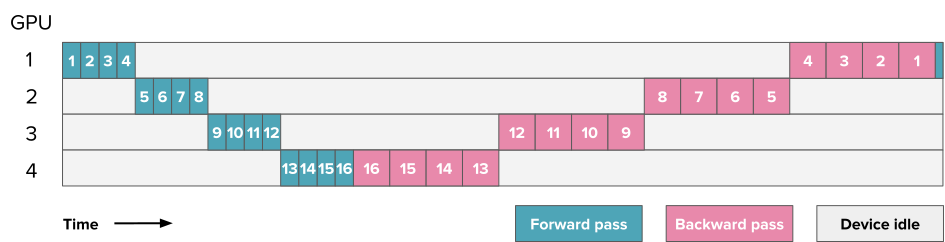
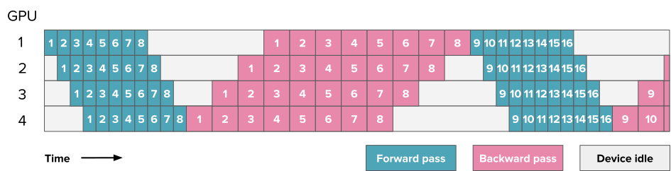
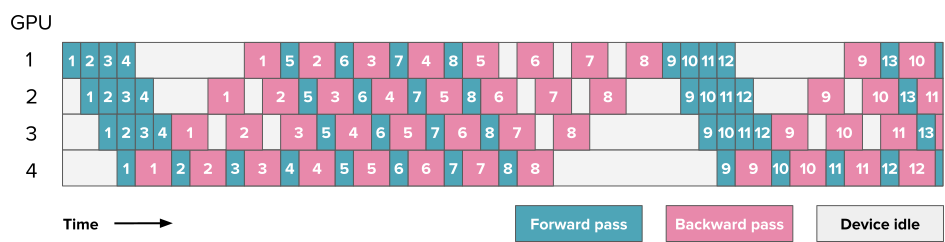
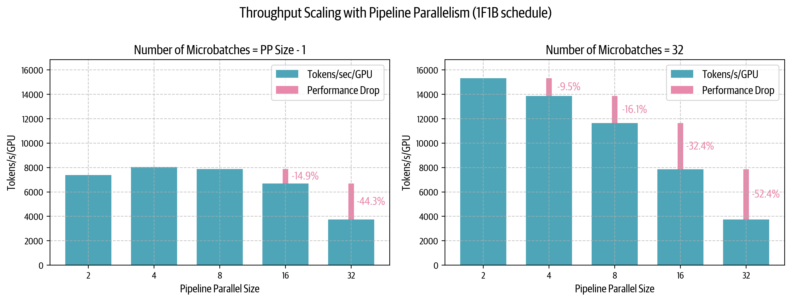
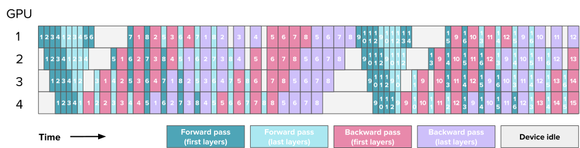
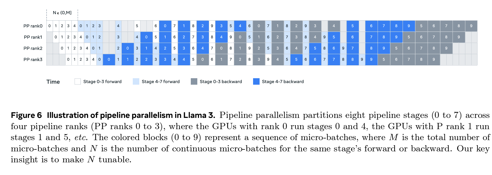
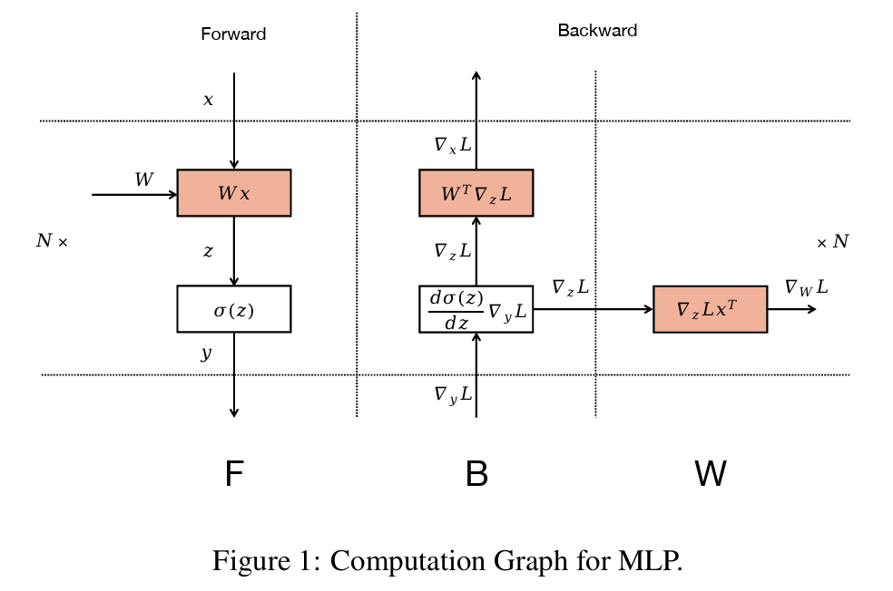
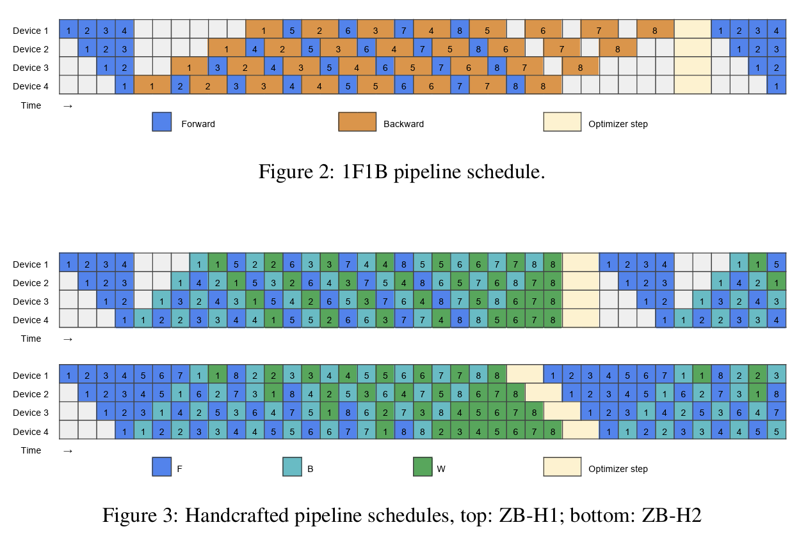
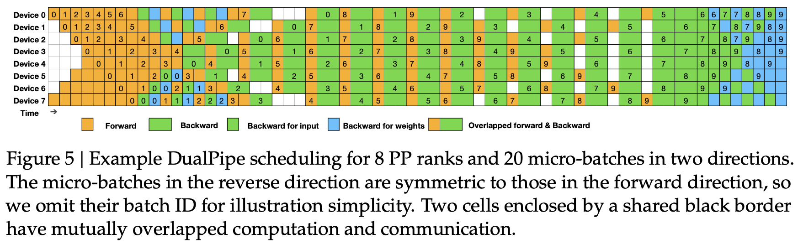

# Pipeline Parallelism

*From [The Ultra-Scale Playbook](https://huggingface.co/spaces/nanotron/ultrascale-playbook)*

## Pipeline Parallelism

To add a podcast feeling to your reading experience, feel free to listen to the NotebookLM hosts discussing the following sections of this book as you're reading along.

In the ["Tensor Parallelism"](#tensor-parallelism) section, we saw that trying to scale tensor parallelism past the number of GPUs on a single node - typically 4 or 8 - forces us to use lower-bandwidth network communication, which can significantly impair performance. We can see the effects of this inter-node communication clearly in the all-reduce operation when we benchmark it on our cluster across several nodes (each node here has 8 GPUs):

<iframe src="fragments/pp_comm_bandwidth.html" width="100%" height="450" frameborder="0" scrolling="no"></iframe>

*[Open full interactive visualization: Pp Comm Bandwidth](fragments/pp_comm_bandwidth.html)*

Inter-node communication bandwidth measurements across different node counts, showing median (lines) and 5th-95th percentile ranges (shaded areas) for all-reduce, all-gather, and reduce-scatter operations

Sequence and context parallelism can help for long sequences, but they don’t help much if the root cause of our memory issues is not the sequence length but rather the size of the model itself. For large models (70B+ parameters), the size of the weights alone can already push past the limits of the 4-8 GPUs on a single node. We can solve this issue by summoning another parallelism dimension: *pipeline parallelism* (PP).

Pipeline parallelism is a simple but powerful technique - we split our model's layers across multiple GPUs! For example, if we have 8 GPUs, we could put layers 1-4 on GPU 1, layers 5-8 on GPU 2, and so on. This way, each GPU only needs to store and process a portion of the model's layers, significantly reducing the memory requirements per GPU. Let's see the effect of pipeline parallelism in action on the memory usage for an 8B parameter model:

<iframe src="fragments/pp_memoryusage.html" width="100%" height="450" frameborder="0" scrolling="no"></iframe>

*[Open full interactive visualization: Pp Memoryusage](fragments/pp_memoryusage.html)*

Looking at the figure above, we notice something interesting: while the model parameters are nicely split across GPUs, the activation memory remains the same on each GPU! which means we don't save any activation memory with this approach.

📝 Note

This is because each GPU needs to perform PP forward passes before starting the first backward pass. Since each GPU handles 1/PP of the layers but needs to process PP micro-batches before the first backward, it ends up storing $PP \times (activs / PP) \approx activs$, which means the activation memory requirement remains roughly the same as without pipeline parallelism.

This introduces a new type of communication pattern: instead of communicating parameters like we did with ZeRO-3 in data parallelism, we're now passing activation tensors sequentially between GPUs in a "pipeline." While conceptually simple, efficiently implementing this technique is quite tricky. Let's dive right into the details!

### Splitting layers on various nodes - All forward, all backward

To start, let’s say we simply spread the layers across several devices - e.g., a first GPU will take the first few layers, a second GPU will take the second part of the model, and so on. The forward pass through our model now simply involves sequentially passing the batch of data along the model and thus successively using each compute device.

We have a direct first advantage: the required interconnect bandwidth stays quite low as we only send moderate-sized activations at a handful of locations along the model depth. This can make a huge difference compared to, for example, the TP approach, where communications happen several times within each layer.

But you may be starting to catch a glimpse of the troubles to come: “sequentially” and “successively”?!? This doesn’t sound very efficient in the world of parallel computations, especially after our discussion of computation and communication overlap.

Indeed, reader! The main challenge in pipeline parallelism is how to efficiently circumvent the sequential nature of PP to keep our GPUs busy at all times and avoid having one GPU computing while the others are waiting. Here's how our GPU utilization looks when doing a naive and simple forward and backward pass through the model (here, the numbers indicate the model layers):

An example of pipeline parallelism for a model with 16 layers distributed across 4 GPUs. The numbers correspond to the layer IDs.

The remaining idle time is indicated in gray and usually called the “bubble.” The sight of this probably broke your heart after we spent so much time optimizing throughput.

We can quantify how efficient a pipeline setup is by looking at how much time we lose because of the bubble. Let’s say $t_f$ and $t_b$ are the times for the forward and backward passes, respectively, as measured for one micro-batch and one stage of the pipeline (a simple assumption is often to have $t_b \approx 2 \times t_f$, as in the above graph). If we could perfectly parallelize, the ideal total time would be $t_{id}=t_f + t_b$. However, in this example due to the pipeline bubble there is additional time of $t_{pb}=(p-1)*(t_f+t_b)$ (where $p$ is the degree of pipeline parallelism; i.e., the number of GPUs). This is the time each GPU is waiting while other GPUs are computing.

We can compute the ratio of the additional bubble time over the ideal time as follows:

$$r_{bubble} = \frac{(p-1)*(t_f+t_b)}{t_f+t_b} = p-1$$

As we add more stages, the bubble time thus increases and the utilization drops. As we can see, the bubble can be very large in a naive implementation!

Thankfully, various pipeline parallelism schemes have been designed to reduce the size of the bubble.

Let’s take a first tool out of our toolbox and think about splitting our batch into smaller bite-sized portions that can be processed in parallel (or almost), like we did before in the DP approach, for instance. Now, when the second GPU is busy processing micro-batch 1, the first GPU can already start processing micro-batch 2. Here is a schedule using eight micro-batches:

The above schedule is called the ***all forward, all backward (AFAB)*** schedule, as we first do all the forward passes and then all the backward passes. The advantage is that forward and backward steps are still generally sequential, so we're preserving the general organization of our model training code. This PP implementation is one of the simplest to implement.

You can find the full implementation of the AFAB pipeline in Picotron:

👉 AFAB PP implementation in Picotron (click to expand)

Let’s estimate the bubble in this example. The difference from our first example is that the ideal time to process $m$ micro-batches is now $t_{id} = m*(t_f+t_b)$:

$$r_{bubble} = \frac{(p-1)*(t_f+t_b)}{m*(t_f+t_b)} = \frac{p-1}{m}$$

As we can see, we can fight some of the inefficiencies of pipeline stages by adding more micro-batches, reducing the size of the bubble by a factor of $m$.

However, just as annoying as the bubble is the memory required for storing all the activations. We need to keep all of the activations in memory until we reach the backward stage, which quickly leads to a memory explosion in these implementations of PP. Can we do better and avoid this issue?

Since the memory explosion is triggered by the activations we store for the backward pass, let’s see if we can start performing the backward pass while we are still performing the forward part of the computation. This will allow us to drop some of the activations needed for the backward pass as soon as possible.

### One forward, one backward and Llama 3.1 schemes

This schedule is called ***one forward, one backward (1F1B)*** because the middle/steady state involves alternately performing one forward and one backward pass. The general idea is to start performing the backward pass as soon as possible. The schedule looks like this:

If you count carefully, you'll see that the bubble still has the same size, so our training efficiency is not significantly improved. However, we only need to store activations for $p$ micro-batches (where $p$ is the degree of pipeline parallelism) instead of $m$ (where $m$ is the number of micro-batches), which can reduce the activation memory explosion we had in the AFAB schedule. As a consequence, we can add more micro-batches, which then will actually reduce the bubble.

A major complexity of this setup, visible in the above figure, is how forward and backward passes are not cleanly sequential anymore but rather are performed in parallel across devices and interleaved. This means we will have to schedule a switch from forward to backward passes independently on each device instead of in a simple and common central training loop as usual.

This is one of the reasons implementing pipeline parallelism usually requires rather extensive modifications to training code as well as modeling code.

You can find a full implementation of 1F1B in Picotron as well:

👉 1F1B PP implementation in Picotron (click to expand)

Let's take a look at how the 1F1B pipeline parallelism schedule scales in practice with some benchmarks on our cluster:

On the left, with a number of micro-batches equal to or less than the PP degree minus one ($m = p - 1$), we see how detrimental the pipeline bubble can be - performance is low and even drops as we scale PP. The righthand plot shows that using many more micro-batches than the PP degree ($m = 32 \gg p - 1$) helps improve low-PP-degree performance, though it's still limited at very large PP degrees. In practice, it's not possible to arbitrarily increase the number of micro-batches to maintain the ratio of $m \gg p - 1$ since we're ultimately constrained by the target global batch size. With a maximal possible number of micro-batches as we add more PP degrees, we'll ultimately have to increase the bubble size according to $r_{bubble} = \frac{p - 1}{m}$.

Interestingly, at a small number of micro-batches the performance only drops by 14% when scaling from one node ($p = 8$) to two nodes ($p = 16$) - a much better scaling than we achieve with tensor parallelism, which typically sees around 43% performance degradation in similar cross-node scenarios. This type of behavior when hitting the lower-bandwidth inter-node network makes pipeline parallelism particularly attractive for distributed training across multiple nodes.

While 1F1B significantly reduces our activation memory footprint, we see in this last graph that the pipeline bubble remains a major efficiency bottleneck. With the bubble size still proportional to the number of pipeline stages, we're leaving valuable GPU compute idle. Can we design an even smarter schedule to minimize this wasted computation time?

### Interleaving stages

The 1F1B schedule let us improve memory usage but didn't have much effect on the size of the idle bubble. Is there any way we can push this frontier?

It turns out this is possible if we are willing to bring in a few additional communication operations. Time to talk about ***interleaved stages***!

Up to now, we’ve sliced our model naively along the model depth dimensions, hosting for instance layers 1-4 on the first GPU and layers 5-8 on the second GPU. But there are other ways we could think about slicing our layers, such as having odd layers (1, 3, 5, 7) on the first GPU and even layers (2, 4, 6, 8) on the second GPU.

This can be seen in general as a kind of “looping pipeline” where a micro-batch will move in circles from one GPU to the next as it goes through the forward pass through the model. Let's take a look at how this works:

An example of interleaved pipeline parallelism for a model with layers distributed across 4 GPUs. Numbers still correspond to the micro-batch IDs, but for clarity we've colored the first and last layers of the model differently to illustrate how layers are spread across GPUs.

Additional communications are required here, as the model goes through each GPU several times for the same computation that previously took just one pass. However, each forward and backward pass is divided by a factor of $v$, where $v$ is the number of stages or model chunks per GPU, as we are able to better interleave forward and backward passes:

$$\begin{aligned}
            &t_{pb} = \frac{(p-1)*(t_f+t_b)}{v} \\
            &r_{bubble} = \frac{1}{v}\frac{(p-1)*(t_f+t_b)}{m*(t_f+t_b)} = \frac{p-1}{v*m} 
            \end{aligned}$$

So, we can now decrease the bubble by adding micro-batches and interleaved stages - but note that quantitatively, the amount of communication also increases by $v$ so it’s a trade-off. In the following plot, you can see several configurations for a PP setup with $p=8$, where the special case of $m=1, v=1$ corresponds to naive pipeline parallelism, the configurations with $v=1$ are AFAB or 1F1B setups, and the $v \neq 1$ cases are interleaved configurations.

<iframe src="fragments/pp_bubblesize.html" width="100%" height="450" frameborder="0" scrolling="no"></iframe>

*[Open full interactive visualization: Pp Bubblesize](fragments/pp_bubblesize.html)*

Scheduling also becomes more complex here, as we have to decide on a given GPU and at a given moment whether we are prioritizing earlier micro-batches going through later layers – meaning that we close the forward and backward loops as fast as possible (the “depth-first” approach, which prioritizes getting batches out of the model as fast as possible) – or later micro-batches going through earlier layers (the “breadth-first” approach, which prioritizes filling in the pipeline as much as possible). This choice is explained in detail in the "Breadth-Fist Pipeline Parallelism" paper[].

You now have all the elements to understand the pipeline parallelism approach in Llama 3.1, which uses a 1F1B setup with interleaved stages and a priority setting tunable between depth-first and breadth-first:

However, we haven’t reached the end of the possible pipeline schedules, and recently some methods have been proposed to **reduce the bubble to virtually zero**! These techniques were, for instance, used in the DeepSeek-V3/R1 implementation[]. Piqued your curiosity? Let’s have a final quick look at these magical schedules before we leave the world of pipeline parallelism!

### Zero bubble and DualPipe

Even more sophisticated ways to reduce the bubble have recently been proposed that reach close to a “zero bubble” regime, such as the pipeline implementation approach in DeepSeek-V3/R1, called DualPipe. The secret here is to split the operations involved at an even finer-grained level in order to interleave them in the most efficient way.

Let’s briefly see how this can work by summarizing Sea AI Lab's zero bubble work[], which is a precursor to DualPipe. The basic observation here is that the backward pass through a matrix multiplication actually involves two separate operations: the backward operation for the inputs ($B$) and the backward operation for the weights ($W$).

While the output of $B$, the backward pass for the inputs, is necessary for performing the backward pass of the lower layers, the backward pass of the weights, $W$, is not and generally only needs to be performed before the optimizer step. We can see that in the following diagram (from the Zero Bubble paper):

This means $W$ can be flexibly scheduled anywhere after the corresponding $B$ of the same stage. This allows for strategic placement of $W$ to fill the pipeline bubbles. The ZB-H2 schedule at the top right is an example of a (theoretical) schedule with zero bubble taking advantage of this fine-grained decomposition.

On the top (Figure 2 from the Zero Bubble paper): the classical 1F1B schedule, interleaving forward and backward passes but keeping a coarse-grained backward pass. On the bottom (Figure 3 from the Zero Bubble paper): two handcrafted schedules splitting the backward pass into finer-grained $B$ and $W$ operations. The lower schedule is an example of a (theoretical) zero bubble schedule taking advantage of this fine-grained decomposition.

DeepSeek’s DualPipe, introduced with its V3 technical report [], is an extension of this decomposed approach to the additional case of two streams propagating from both ends of the PP dimension, with these streams being interleaved to further minimize idle time in the GPUs. This schedule is displayed in the following scheduling graph - as you can see, it's even more complex than the previous ones:

In general, fully optimizing such complex schedules involves carefully measuring the duration of the various fine-grained operations and solving an Integer Linear Programming (ILP) problem to minimize the final bubble time. (See, for instance, the Zero Bubble paper[] for a discussion of the heuristics and algorithms used to perform such scheduling.) As a result, the zero bubble and DualPipe schedules are too complex for us to give code snippets here, but you should have a general idea of the concepts involved.

This concludes our tour of the world of pipeline schedules and bubbles. We hope you enjoyed it!

It's now time to turn to the last parallelism method we'll detail, which we can use to train large models efficiently: ***expert parallelism***.
